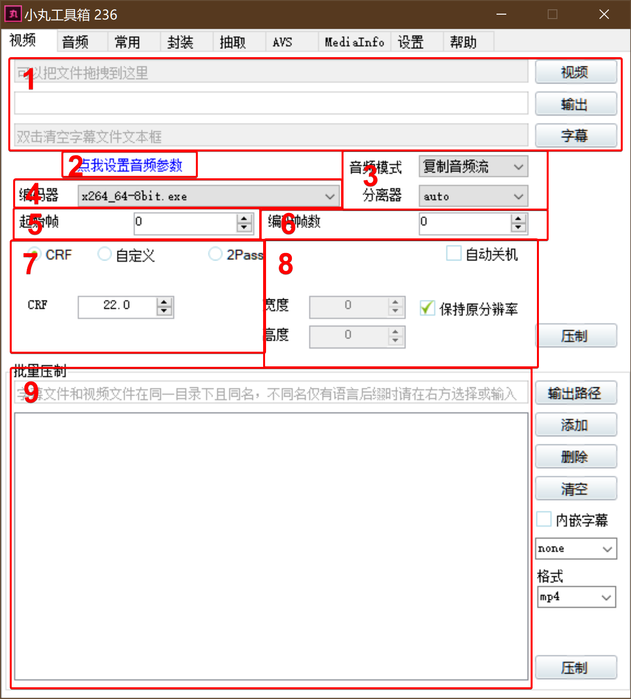
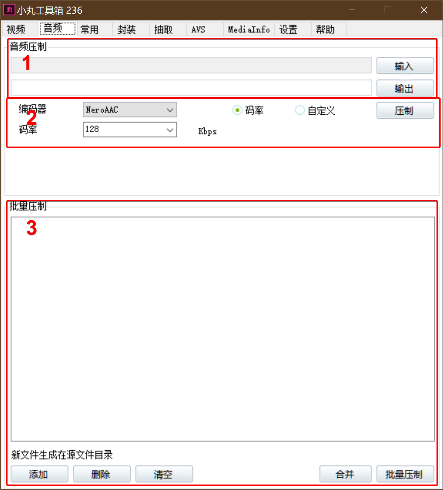
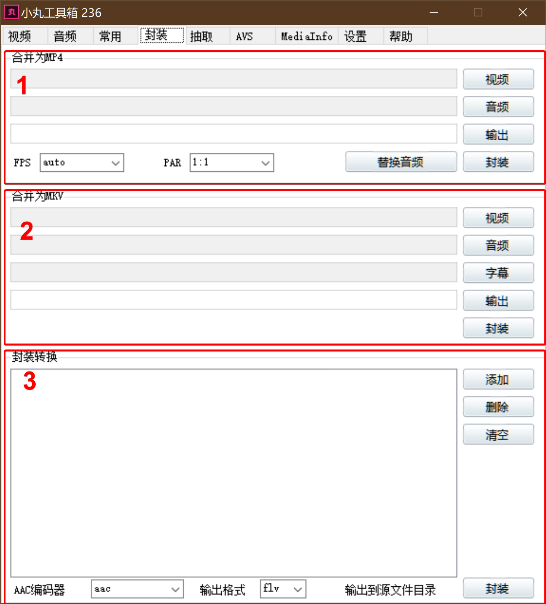
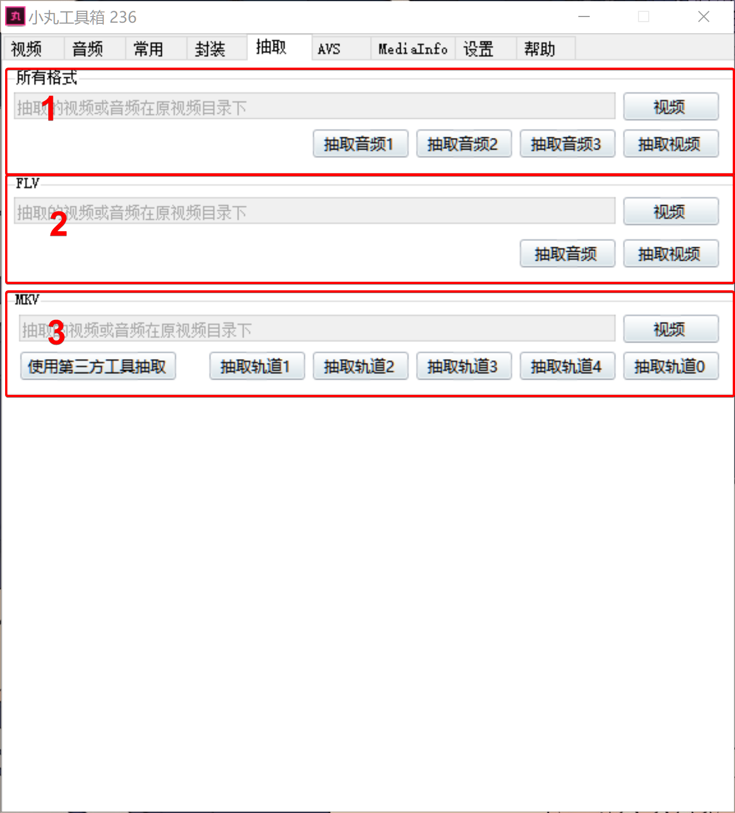
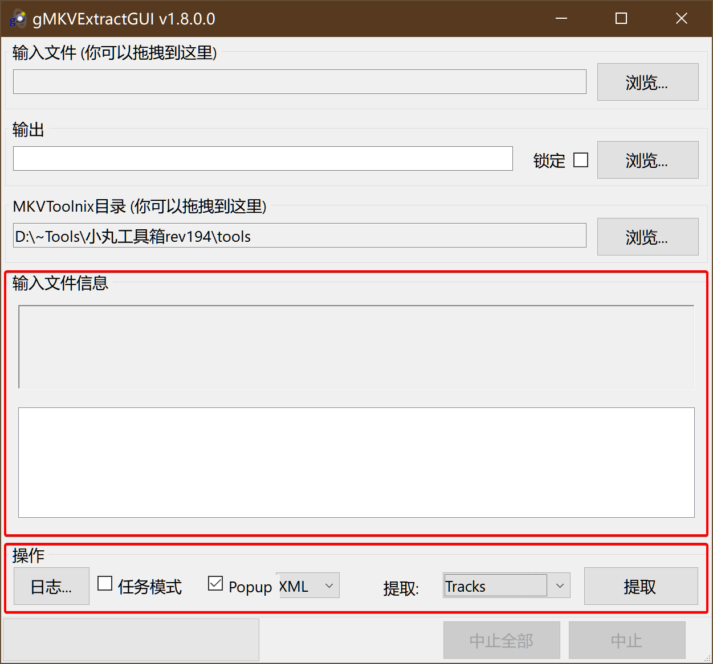
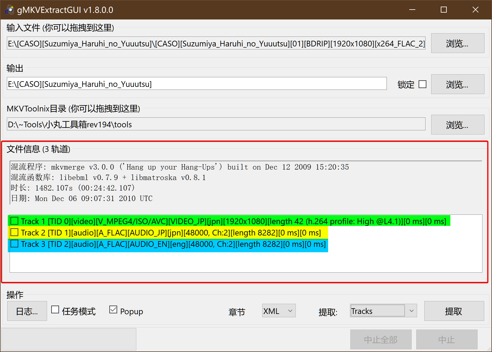
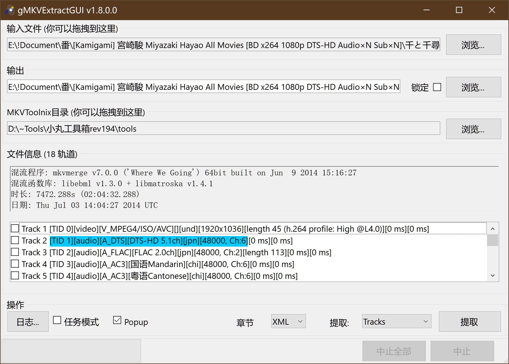
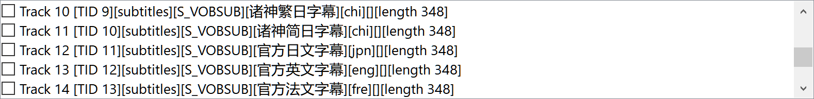
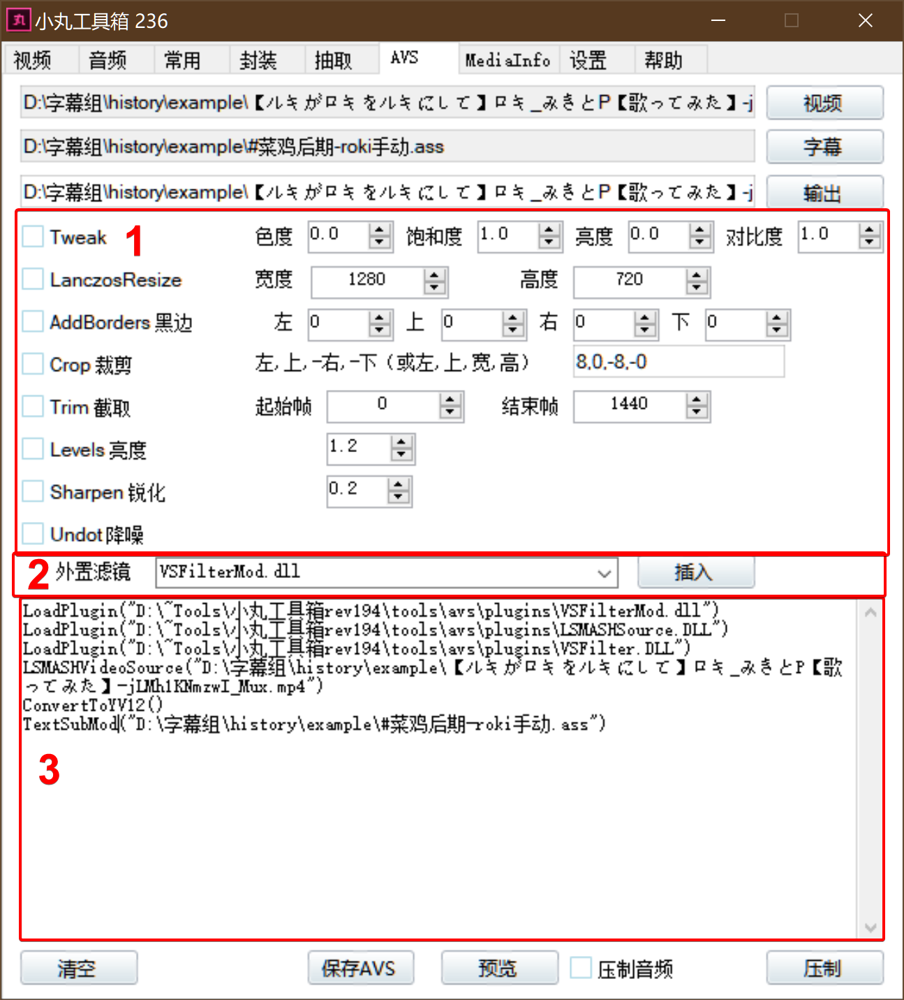
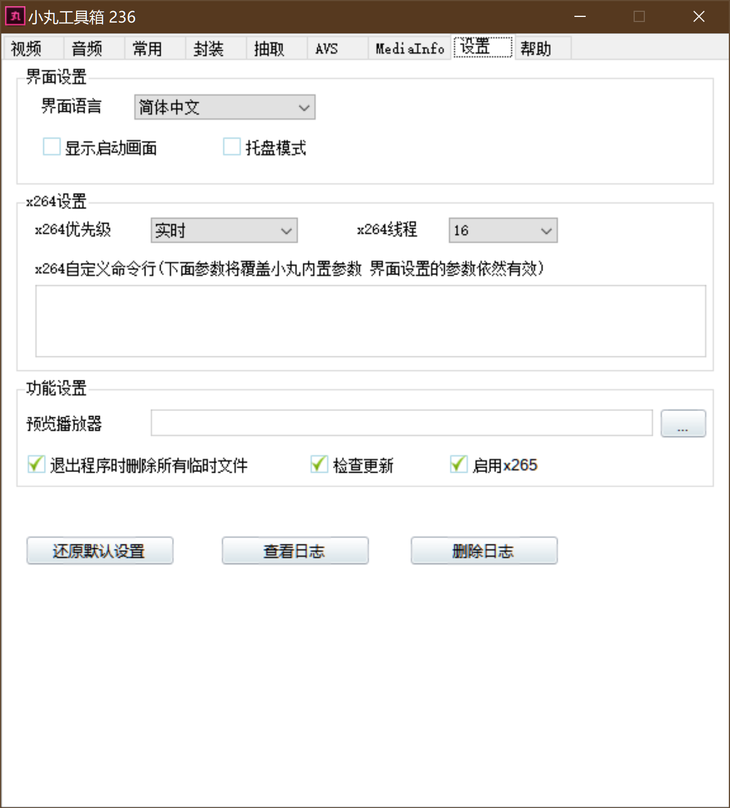

# 第一章 认识小丸

>本章主要介绍小丸的界面以及用法
>
>本章共1809字
>
>预计阅读时间>8min

---

<!-- toc -->

## 1.0准备

- [ ] 小丸工具箱
- [ ] 如果发现报错，请安装`.NetFrameWork` [这里](https://pan.baidu.com/s/1sl7KhvZ)
- [ ] *可选*64位的Avisynth滤镜

提示：64位的滤镜**不稳定**，所以如果你32位能压，就不要换，如果要换，就用megui64位压，小丸老了

---

## 1.1 视频

来，一块一块讲

1. 上面写得很清楚了所以不讲

2. 点击之后会跳转到音频界面

   

   还是一个一个区域来讲

   1. 这个不用讲 =.=

   2. 这里选择的格式是**全局通用**的，也就是说你再这里设置了，你不管是AVS压制还是怎样都是用这里的参数，一般设置为`NeroAAC 320Kbps`，你可以在[这里](EX_Words.md#解编码器)看详细的说明。

   3. 这个一般是GalGame压制组用的，我们基本用不上。

3. 这里选的是分离音频的参数，一般选择`复制音频流 auto`，至于里面那些分离器，你不用了解，你只用知道默认是`Lavf`就好，你可以在[这里](EX_Words.md#解封装)看详细的说明。

4. 这里选择视频编码器，一般选择`x264_64-8bit`，没有特殊情况不要选其他的。那些会在进阶压制中用到。

5. 起始帧 从哪帧开始编码

6. 编码帧数 编码多少帧

7. 这里选择的是编码选项，**全局通用**。关于如何选择，会在后面的章节说到，现在先默认为`CRF 21`

8. 这里是调整大小的选项，极少用到

9. 下面的批量压制一般是番剧字幕组出季度总集放种子的时候用的

---

## 1.2 封装

> 音频刚刚讲过了所以跳过（
>
> 常用那些已经过时了所以跳过

封装，即Mux，有关封装容器的一些解释，可以在[名词解释](EX_Words.md)这一章找到

1. 这里是比较常用的一块，建议手动设置FPS，怎么看，后面会讲。然后PAR(Pixel aspect ratio,像素比例)这个1:1就好，有特殊情况再说。
2. 这里的MKV封装比较特殊。MKV(Matroska Multimedia Container)是一种能在一个视频内封装多个字幕，多个音频的一个视频容器，常用于发布多语言视频。你可以拿同一个MKV反复封装而不会覆盖原有数据。
3. 这个封装转换也基本不常用，会在进阶操作中稍微提到一点

## 1.3 抽取

抽取，即Demux。即将封装容器中的音视频分离。

1. 这是所有格式都适用的，MP4，FLV等格式只有一个音频轨，所以点抽取音频1就好

2. 同上

3. 这里建议点“使用第三方工具抽取”

   

   输入和输出就不讲了

   接下来使用华盟字幕社的凉宫春日片源来讲解

   

   这里由于是外挂字幕，所以没有字幕轨

   以第一行为例

   `Track 1 [TID 0][Video][V_MPEG4/ISO/AVC][VIDEO_JP][jpn][1920x1080][length 42 (h.264 profile:High @L4.1)][0ms][0ms]`

   - `Track 1` 轨道

   - `TID 0` 轨道编号

   - `[video]` 轨道种类 ，有`[video]` `[audio]` `[subtitles]`

   - `[V_MPEG4/ISO/AVC]` 轨道编码种类，视频常见有MPEG4，音频常见有AAC FLAC      WAV，详细的列表在[这](https://matroska.org/technical/specs/codecid/index.html)

   - `[VIDEO_JP]` 视频语言，一般不用在意

   - `[jpn]` 语言

   - `[1920x1080]` 分辨率

   - `[length 42 (h.264 profile:High @L4.1)]`前面的length不用管，指的是在容器中的储存位置。后面括号里面的东西就是编码详细信息，编码(h.264) 等级(High @L4.1)

   - `[0ms][0ms]` 延迟时间，第一个是开始，第二个是结束

   `Track 3 [TID 2][audio][A_FLAC][AUDIO_EN][eng][48000, Ch:2][length 8282][0ms][0ms]`

     略过上面讲过的，跳到没见过的

   - `[48000, Ch:2]` 这里说的是音频采样率。后面的Ch说的是声道数，一般为2，电影也许会出现5或更高，如下图就是千与千寻的轨道

     

   再跳过一部分，我们直接看到字幕部分

   

   跳过见过的

   - `[S_VOBSUB]` 这种字幕常见于光盘中，如果是字幕组发布的，可能是`[S_ASS]` `[S_SSA]`等的这种
   - 操作部分
     - 任务模式通常用于批量抽取，你需要先提取章节XML出来，再进行抽取
     - 章节 分为`XML` `OGM` `CUE`三种格式，基本用不到。在名词补充中会提到。
     - 提取 一般选择`Tracks`，这种模式才是提取轨道，顺便讲一下其他的
       - `Cue_Sheet` 这个是提取Cue表，不知道的可以去名词补充那一章看
       - `Tags` 提取标签，就是轨道信息
       - `Timecodes` 提取轨道时间码
       - 下面那些都不用解释

---

## 1.4 AVS界面

   `AVS`即`AviSynth`，是由微软开发的一个视频帧服务。可以理解为逐帧处理后返回给编码器进行汇合。

无特殊需求是不用AVS的，当后期man对你说“需要挂Mod”的时候，就需要用到这个界面了。这种情况通常是后期man用了`VSFilterMod`里面的一些进阶代码。

   

   这里以ロキルキ的ロキ和黑兔的ロキ特效轴为例讲解

   1. 这一部分是AVS的内置滤镜，一般不用管，但是如果你的视频是低画质有点糊的话，建议把锐化勾上 调为0.3，然后降噪勾上。其他的写得也很清楚了，在这就不多说了。
   2. 外置滤镜。小丸自带很多外置滤镜，但是都比较老了，其中很多如果没有特殊需求都用不上。我会附一份简要说明在[AVS滤镜列表](EX_AVSFilter.md)里面。一般来说我们只需要拉到最下面，然后选择VSFilterMod.dll然后插入就好。
   3. AVS脚本区。这里通常是自动插入的，不用管，但是要注意`TextSub`要改成`TextSubMod`。
   4. 勾选或不勾选压制音频随你，保存AVS可以用于Megui压制。

---

## 1.5 设置

这是小丸的设置界面

如果你在压制的时候不用电脑的话，**建议**X264优先级为实时，然后线程调为16。

如果你要在压制的时候用电脑的话，**建议**X264优先级为高于普通，然后线程为4。

其他的就不解释了。

---

## 1.6 总结

本章主要讲了小丸的基本界面以及其用法，文中提到一些专有名词，大家可以在名词补充一章中找到（咕）

希望大家下次再碰到需要挂Mod压制的视频不会一脸懵逼了（笑）

---

最后修改

Gerardyang

2019.04.20

本文无法遵守996 License

本作品采用[知识共享署名-相同方式共享 3.0 未本地化版本许可协议](http://creativecommons.org/licenses/by-sa/3.0/)进行许可。