# 第二章 到认识Megui

> 本章主要介绍Megui的界面以及其用法
>
> 本章共 字
>
> 预计阅读时间 min

---

<!-- toc -->

## 2.0 准备

- Megui 64位 ==(如果你电脑是32位的请下载32位的)==

---

## 2.1 Megui

Megui是一个带有图形化界面的命令行工具集。其功能比小丸强大，压制质量也较高，但操作比较麻烦。

**除了本体之外，大部分工具需要在Megui里面进行下载**

*标注为**粗体**的为建议下载，标注为==高亮==的为必须下载*

| 名称                 | 功能                                                       |
| -------------------- | ---------------------------------------------------------- |
| AVI-Mux GUI          | 将多个视频流，音频流，字幕流合并进一个视频文件*已停止开发* |
| ==AviSynth==         | 用于AVS的预览以及压制                                      |
| ==Besplit==          | 音频流剪切以及修复                                         |
| **DGIndex**          | 为AviSynth滤镜DGdec建立MPEG流媒体索引                      |
| eac3to               | 全称encode AC3 to，即转换AC3格式的工具。                   |
| ==FFMpeg==           | 几乎全能的工具                                             |
| **FFMS**             | FFmpegSource，跨平台的FFMPEG库，Avisynth滤镜以及索引多媒体 |
| **FLAC**             | flac解编码器                                               |
| Haali Media Splitter | Mkv剪切工具                                                |
| **LAME**             | MP3解编码工具                                              |
| ==L-SMASH Works==    | AviSynth滤镜，用于加载多媒体源                             |
| ==MediaInfo==        | 查看多媒体信息                                             |
| mkvmerge             | 合并多轨mkv                                                |
| ==MP4Box==           | 专业的MP4封装工具                                          |
| **NeroAacEnc**       | 解编码AAC音频流                                            |
| OggEnc               | 编码Ogg文件                                                |
| **Opus**             | 解编码Opus音频流                                           |
| PgcDemux             | 用于解封装DVD里面的文件(VOB IFO ac3 dts)                   |
| tsMuxeR              | 封装MPEG-ts流文件                                          |
| VobSub Ripper        | 解析DVD中的字幕文件                                        |
| ==x264==             | [H.264/MPEG-4 AVC](EX_Words.md#x264)解编码器               |
| **x265**             | [H.265/HEVC](EX_Words.md#x265)解编码器                     |
| XviD                 | [XviD](EX_Words.md#xvid)解编码器                           |

---

## 2.2 Megui的界面

emmmm……

要说的东西有点多

<big>要 素 过 多</big>

<del>
咕
</del>

不咕鸟

---

### 2.2.1 主界面

> **请注意图片中的值不一定是最好的**

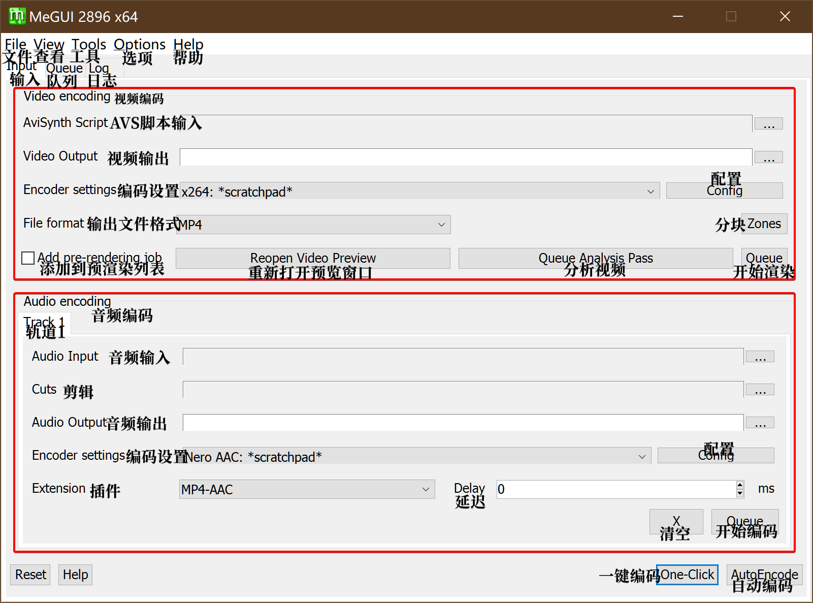

你可以看到输入区主要分为两块，视频输入与音频输入

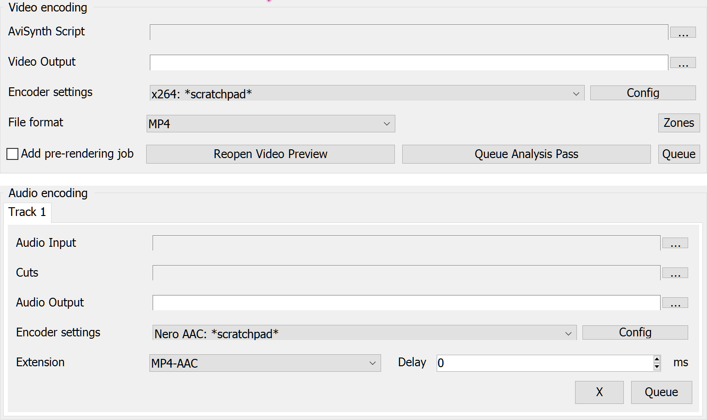

#### 2.2.1.1 视频输入区

先来讲讲视频输入区

**AviSynth Script**: 这里用于插入AVS脚本文件，你可以像小丸一样把avs拖进去，他会自动进行检测，如果没有错误的化他会打开一个预览窗口

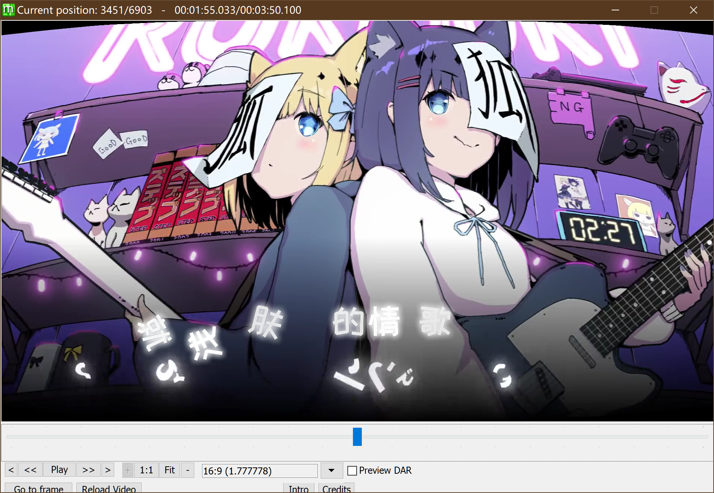

你可以拖动进度条来查看有没有挂上mod或者脚本有没有写漏的

如果确认无误之后右上角关闭就好

**Video Output**: 视频输出的位置

**Encoder settings**: 编码器设置

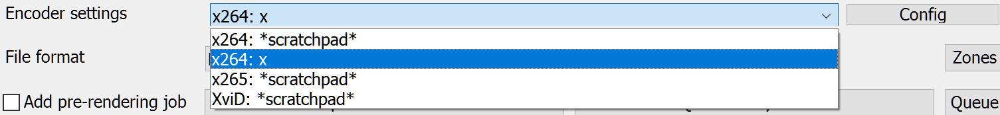

你们可能会没有第二个，第二个是我自己的预设，稍后会讲如何储存编码器预设，**右边的Config**是设置。

#### 2.2.1.2 音频输入区

在频频输入区你可以选择把音频文件拖进去，也可以输入avs脚本

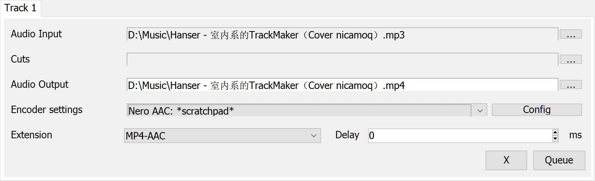

上面的track选项卡，是当你需要输出mkv的时候才会出现多track的情况，一般用不到。

重复的略过

**Cuts**: 输入Megui的cut记录文件，可以在菜单栏的Tools-Audio Cut来创建cut记录文件

编码器设置

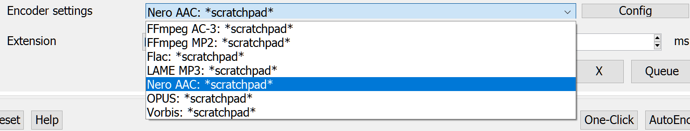

你们的也许和我的有所不同，可能会少一点，但是我们主要用到的就是Nero AAC或者QAAC，右边的Config是编码选项

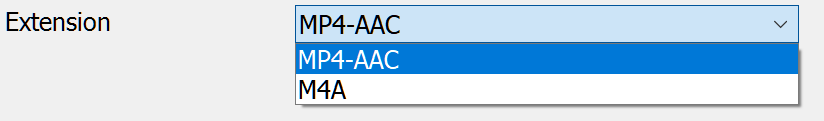

这里是输出格式，一般选择MP4-AAC

---

### 2.2.2 X264设置界面

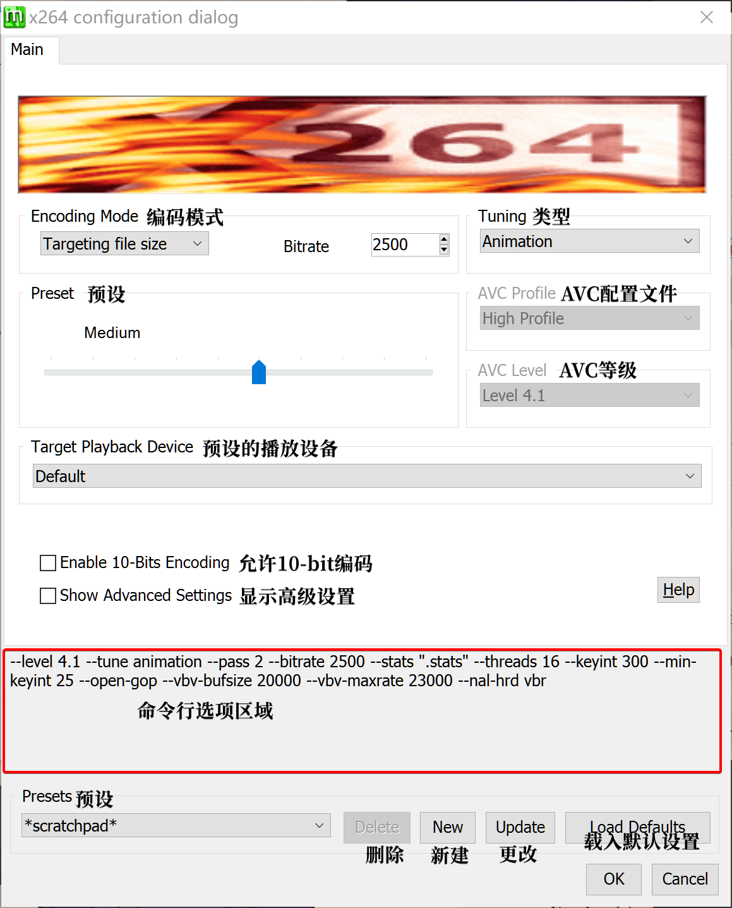

这是点开config之后的界面，你们的或许和我的有些不同。现在仅作介绍，里面的参数起什么作用，会在压制这一章说

勾选了“显示高级选项之后”

也许界面略有不同，但是你会发现多出来一堆东西

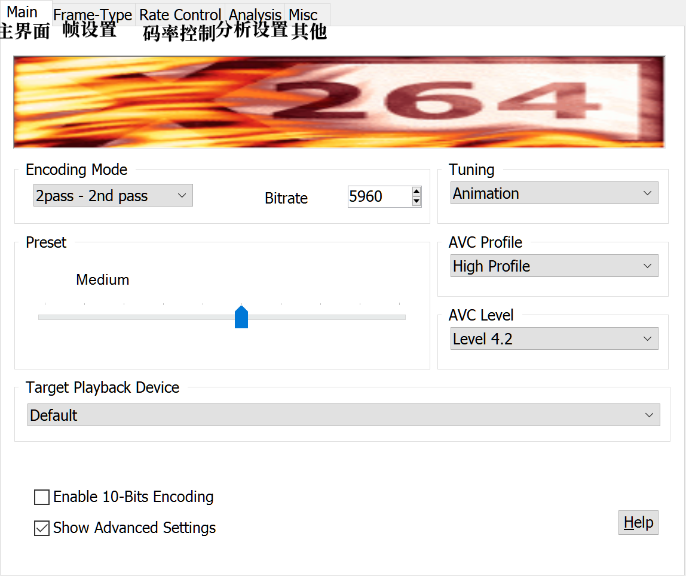

#### 2.2.2.1 帧设置

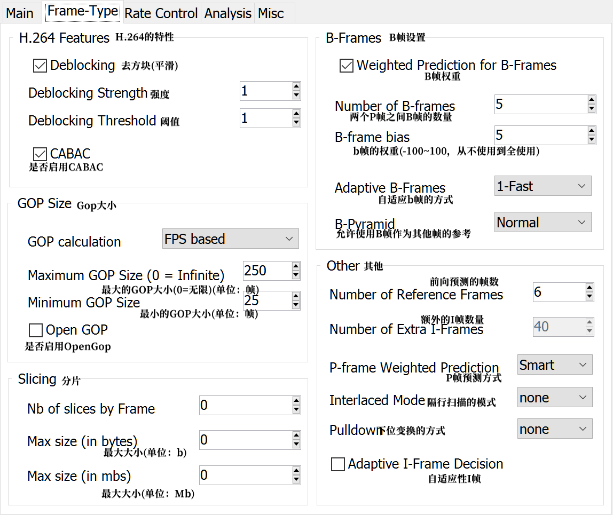

#### 2.2.2.2 码率控制

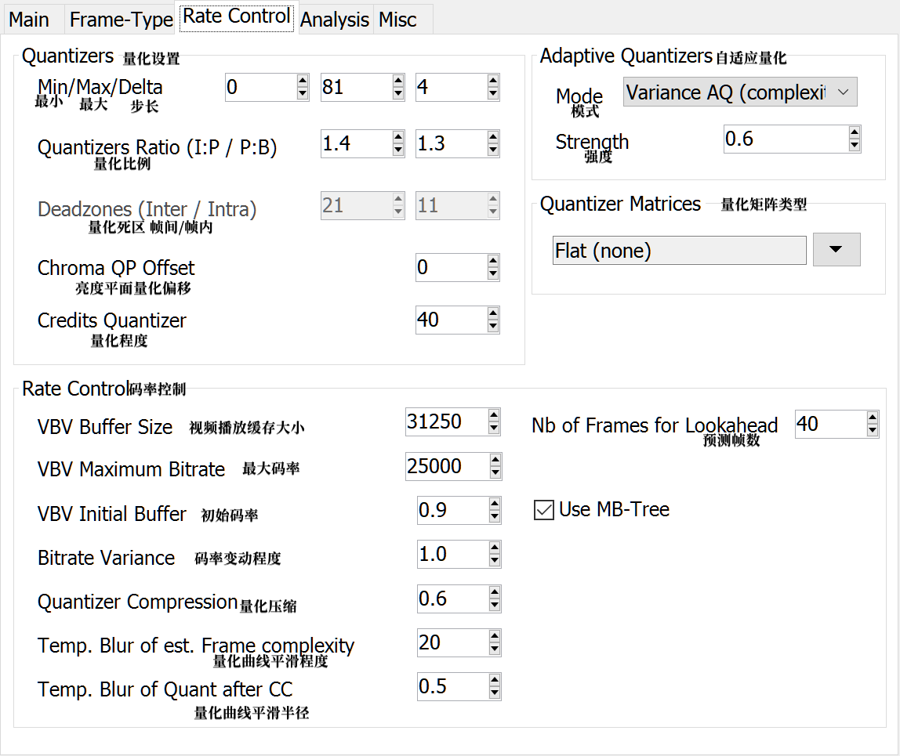

#### 2.2.2.3 分析

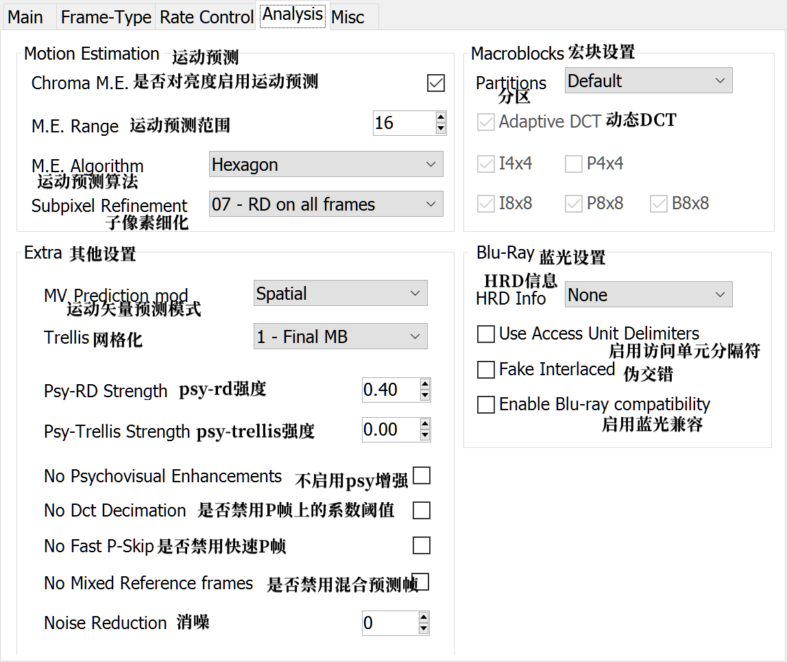

#### 2.2.2.4 其他

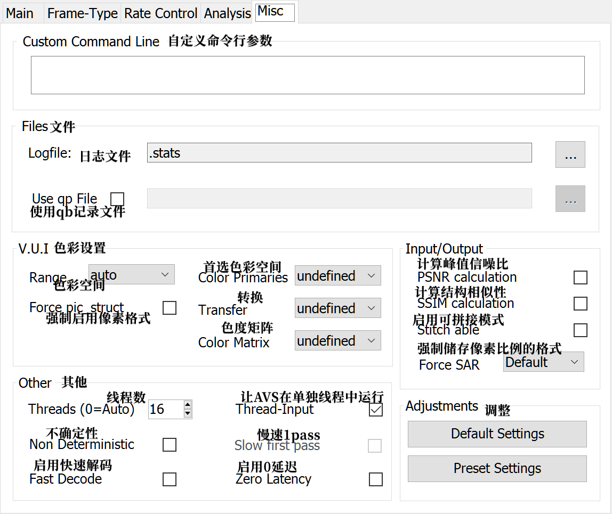