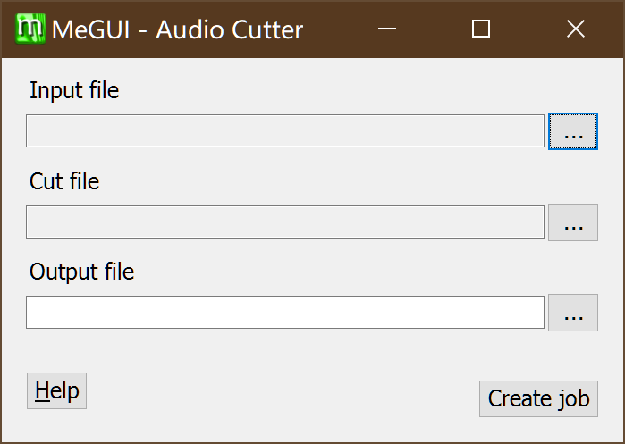

# 第二章 到认识Megui

> 本章主要介绍Megui的界面以及其用法
>
> 本章共3674字
>
> 预计阅读时间>15 min

---

<!-- toc -->

## 2.0 准备

- Megui 64位 ==(如果你电脑是32位的请下载32位的)==

---

## 2.1 Megui

Megui是一个带有图形化界面的命令行工具集。其功能比小丸强大，压制质量也较高，但操作比较麻烦。

**除了本体之外，大部分工具需要在Megui里面进行下载**

*标注为**粗体**的为建议下载，标注为==高亮==的为必须下载*

| 名称                 | 功能                                                       |
| -------------------- | ---------------------------------------------------------- |
| AVI-Mux GUI          | 将多个视频流，音频流，字幕流合并进一个视频文件*已停止开发* |
| ==AviSynth==         | 用于AVS的预览以及压制                                      |
| ==Besplit==          | 音频流剪切以及修复                                         |
| **DGIndex**          | 为AviSynth滤镜DGdec建立MPEG流媒体索引                      |
| eac3to               | 全称encode AC3 to，即转换AC3格式的工具。                   |
| ==FFMpeg==           | 几乎全能的工具                                             |
| **FFMS**             | FFmpegSource，跨平台的FFMPEG库，Avisynth滤镜以及索引多媒体 |
| **FLAC**             | flac解编码器                                               |
| Haali Media Splitter | Mkv剪切工具                                                |
| **LAME**             | MP3解编码工具                                              |
| ==L-SMASH Works==    | AviSynth滤镜，用于加载多媒体源                             |
| ==MediaInfo==        | 查看多媒体信息                                             |
| mkvmerge             | 合并多轨mkv                                                |
| ==MP4Box==           | 专业的MP4封装工具                                          |
| **NeroAacEnc**       | 解编码AAC音频流                                            |
| OggEnc               | 编码Ogg文件                                                |
| **Opus**             | 解编码Opus音频流                                           |
| PgcDemux             | 用于解封装DVD里面的文件(VOB IFO ac3 dts)                   |
| tsMuxeR              | 封装MPEG-ts流文件                                          |
| VobSub Ripper        | 解析DVD中的字幕文件                                        |
| ==x264==             | [H.264/MPEG-4 AVC](EX_Words.md#x264)解编码器               |
| **x265**             | [H.265/HEVC](EX_Words.md#x265)解编码器                     |
| XviD                 | [XviD](EX_Words.md#xvid)解编码器                           |

---

## 2.2 Megui的界面

emmmm……

要说的东西有点多

<big>要 素 过 多</big>

<del style="font-size:100px">咕</del>

不咕鸟

---

### 2.2.1 主界面

> **请注意图片中的值不一定是最好的**

#### 2.2.1.1 菜单栏

这里的打开文件会自动进行判断，如果是AVS文件，就插到视频输入区去，如果是其他文件 ，就判断是否有音轨，如果有，就插入到音频区，如果没有，就抛出一个Error

这里是当你开始压制的时候，可以点这里看进度什么的

跳过Tools，那是工具列表，后面讲

跳过Options，因为一点就会进选项界面，后面讲

这里一般用不上，用户指南已经三四年没更新了（

#### 2.2.1.2 视频输入区

先来讲讲视频输入区

**AviSynth Script**: 这里用于插入AVS脚本文件，你可以像小丸一样把avs拖进去，他会自动进行检测，如果没有错误的化他会打开一个预览窗口

你可以拖动进度条来查看有没有挂上mod或者脚本有没有写漏的

如果确认无误之后右上角关闭就好

**Video Output**: 视频输出的位置

**Encoder settings**: 编码器设置

你们可能会没有第二个，第二个是我自己的预设，稍后会讲如何储存编码器预设，**右边的Config**是设置。

#### 2.2.1.3 音频输入区

在频频输入区你可以选择把音频文件拖进去，也可以输入avs脚本

上面的track选项卡，是当你需要输出mkv的时候才会出现多track的情况，一般用不到。

重复的略过

**Cuts**: 输入Megui的cut记录文件，可以在菜单栏的Tools-Audio Cut来创建cut记录文件

编码器设置

你们的也许和我的有所不同，可能会少一点，但是我们主要用到的就是Nero AAC或者QAAC，右边的Config是编码选项

这里是输出格式，一般选择MP4-AAC

---

### 2.2.2 X264设置界面

这是点开config之后的界面，你们的或许和我的有些不同。现在仅作介绍，里面的参数起什么作用，会在压制这一章说

勾选了“显示高级选项之后”

也许界面略有不同，但是你会发现多出来一堆东西

#### 2.2.2.1 帧设置

> 这个设置界面主要用于控制画面清晰度，细节等

**Deblocking**，说成抗锯齿可能会合适一点，强度太大画面会变糊，像是开了线性模糊一样。阈值越小细节越多(图中这个跟没开一样)。

**[CABAC](EX_Words.md#cabac)**，就是Context-based Adaptive Binary Arithmetic Coding，前文参考性自适应二元算术编码

**[GOP](EX_Words.md#gop)**其实就是一个帧序列编组，理论上大的数值会比较清晰，但是太大也不好。

**Open Gop**是一种GOP编码方式，指可以通过上一个GOP序列来预测下一个GOP序列，相对的Close GOP就只会在单个GOP序列里面进行预测。简而言之，打开较好。

**Slicing**，emmmmmmm这东西很难翻译，大概就是h264里面通过slice这种技术可以提高抗干扰能力，通过将图像分为几个单独的slicing来处理，可以防止错误解码的扩散。

#### 2.2.2.2 码率控制

量化这种码率控制方式已经不常用了，比较重要的就是视频最大码率这一块，建议设置为~~23500~~23000，因为b站最大码率限制为24000。

至于VBV Buffer Size的限制和[level](EX_Word.md#level)有关

#### 2.2.2.3 分析

**Psychovisual**，就是心理的意思，psy是一个比较玄学的选项，简单来说就是让你“看起来”更好。

运动预测嘛emmmm

上图（图略大）

你可以看到这些箭头，这些箭头的意思是根据上一帧以及这一帧预测的下一帧的像素运动，而b帧和p帧是记录这些信息的

而宏块，就是用来将运动预测分为几部分的，如果没有特殊要求的话是不用改的

#### 2.2.2.4 其他

这里的**Threads**推荐设置为CPU数目*1.5 

快速解码和0延迟是在直播流中常用的编码技术

右边的**PSNR** **SSIM**选项可以提高编码质量，但是会延长编码时间

**stitch able**这个一般是用在蓝光盘里面的，一个视频分成几个视频来储存

### 2.2.3 NeroAAC设置界面

==这里Decoder翻译成了编码器XD，翻译错了，应该是解码器==

一般来说采取图1的配置方式，要是音质太差可以考虑图二

### 2.2.4 Queue界面

不讲（

太简单了（

而且你一般也用不上（

### 2.2.5 Log界面

一般就这样，或许略有不同。

出错了才来看，一般不出错的不用管，出错了也会有提示

---

## 2.3 Megui的选项

这里主要是设置Megui整个程序的一些设置，比如说

还是来分块讲吧

### 2.3.1 主要设置

这边一般不用管，你可以选择在AVS完成解析后不打开预览窗口，不显示压制进度窗口，你也可以自行安装AviSynth然后不使用内置的那个

这个进程优先度建议改，如果你要边压制边用电脑的话，建议改成normal或者below normal，如果不用的话，改成highest就好

一般来说这个是不用管的

### 2.3.2 额外设置（拓展）

一般来说就不用改了

### 2.3.3 进程/队列设置

其实这里的预设翻译成规则是不是会好点呢emmmmmm

### 2.3.4 外部程序设置

neroaac fdk aac 都是要自己下载的

---

## 2.4 Megui的工具

### 2.4.1 Audio Cutter

这就是打开的界面，在**Input file**处选择打开的文件，**Cut file**可以通过**AVS Cutter**来创建，AVS可以通过**AVS Script Creator**来创建。

嘛……意思就是你需要把音频单独抽出来，然后根据视频时间来剪……

基本没用（

除非你想把歌回的歌 单独抽出来

### 2.4.2 Auto Encoder

这个和下面的AutoEncode的按钮是一样的，你需要先载入一个视频，然后点auto encode

然后如果你需要输入音频的话就打上下面那个勾，它会给你把音频自动封进去

### 2.4.3 AVC Quant Matrix Editor

这个就是上面提到的量化矩阵，嘛……一般不用管，除非你是压片组需要特殊设置，比如修复某帧画面，高压之类的

### 2.4.4 AVS Cutter

他会要求你选择一个AVS脚本，必须要有视频

会打开两个窗口，一个是预览窗口，你可以在上面标题的位置看见现在的时间点，并且在右边的cutter输入

注意时间不能重叠，输入完成后点add可以新建，clear可以清空，update可以更改，remove可以删除一条。

**transition style** 那里可以选择剪辑之间的转场方式，是不要转场，还是渐变，还是溶解。

你可以选择**Add cuts to script**来加入AVS脚本，这样编码的时候就会有剪辑的效果。

**Save cuts file**是用来保存cuts文件，然后输入Audio Cutter进行剪辑的 

**close**就会直接关闭，什么都不会发生

你也可以选择**Do all and close** 这样的话会写入AVS，同时保存cut文件

### 2.4.5 AVS Script Creator

先讲一下AVS预设，点右边的config会弹出一个窗口

建议大家在模板处加载一个VSFilterMod的dll，然后点update保存后点ok

这边这一堆额外设置和下面那个一样，只是提供一个默认值而已，通常不用管

当你选择了视频文件之后，会弹出来一个窗口

这里推荐使用第二个 File Indexer，因为第一个如果你输入字幕的话会强制给你变成MKV

然后会打开一个**[File Indexer](#248-file-inxder)**的窗口

稍等片刻就好，然后会弹出来一个预览窗口让你预览，现在还是没有字幕的状态，关掉就好，切换到第二个选项卡

其他全都不用管，在字幕那里载入一个ass就好

然后切换到第三个选项卡

你会发现跟模板设置里的一样，甚至自动帮你载好了滤镜，这个时候要注意，如果你加载了Mod的话，和小丸一样，这里要手动改成TextSubMod

然后你可以点击下面的来预览你的文件，确认无误后点save

然后你会发现他自动帮你插入好了，这时候点一下**AutoEncode**就会打开[**Auto encoder**](#242-auto-encoder)窗口，然后点右下角的ok，会打开[**Adaptive Muxer**](#2410-muxer)窗口，然后啥都不用改按ok

然后就会自动帮你一条龙服务根本不用担心

### 2.4.6 Bitrate Calculator

就是码率计算

### 2.4.7 Chapter Creator

章节创建

有时候你会在看视频的时候发现有些标记

一般来说只对MKV有用

一般来说会把op标出来，方便跳过，像是上面这个一样，第二章就是op

而中间这一个就是转场，后面那一个就是ed

![[アニメ BD] Fate-kaleid liner プリズマ☆イリヤ(第1期) 第09話「ここで終わらせる」](images/1557297998647.png)

或者有的压片组会把名称标出来，Opening，PartA PartB Ending等的这些

<small>*P.S.以上这个出自 [アニメ BD] Fate-kaleid liner プリズマ☆イリヤ(第1期) 第09話「ここで終わらせる」*</small>

一般来说选择输出xml格式，然后封装到MKV容器里

### 2.4.8 File Inxder

一般用**L-SMASH**来索引，如果出现字幕对不上，可以选择第一个**FFMSIndex**。然后点queue

### 2.4.9 HD Streams Extractor

用于抽取光盘里面的文件

### 2.4.10 Muxer

这里讲一系列封装工具，由于所有muxer的界面都一样，就不分开讲了

这里注意，不要输入字幕文件，否则会强制给你输出mkv

### 2.4.11 One Click Encoder

One Click Encoder的界面类似于Adaptive Muxer，但是多了一些选项

同样的，输入字幕文件的话会帮你使用MKV来包装，所以如果要打字幕，请用AVS脚本来打

反正就是特别无脑的一键式操作，还是不太推荐

### 2.4.12 Updater

你可以通过这个来安装工具包，你会发现有些包是disable的，你可以右键这个包然后点击Enable，同样的操作可以disable这个包

然后点下面的update就可以开始安装了

### 2.4.13 VobSubber

当你输入一个IFO文件之后，会打开一个窗口

然后继续无脑点点点就好

---

## 2.5 Megui的使用

如果你有现成的AVS脚本，把它拖到主界面的输入框，然后点视频编码的queue就好

如果你没有，点击 Tool - AVS Script Create 

然后拖入视频文件，按照上方说明来使用就好

---

最后修改

Gerardyang

2019.05.08

本文无法遵守996 License

 本作品采用<a rel="license" href="http://creativecommons.org/licenses/by-sa/4.0/">知识共享署名-相同方式共享 4.0 国际许可协议</a>进行许可。