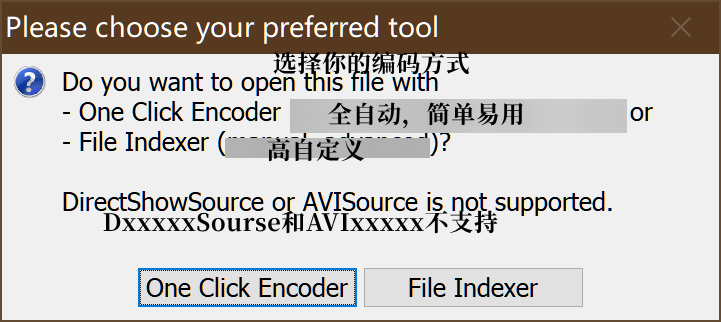

# 第四章 Start ~~Dash~~压制!

> 本章开始压制实际操作
>
> 本章共 字
>
> 预计阅读时间 min

---

<!-- toc -->

## 4.0准备

- [ ] 小丸或Megui

**建议使用Megui进行压制**

*实际上来说，压制质量 命令行手动压制 > 软件GUI压制，不过很麻烦，非常麻烦，麻烦到新手劝退*

---

## 4.1 压制参数说明

在实际的压制过程中，要根据实际需求来选择模式。

这里，根据B站目前的二压线：`平均码率6000 最高码率24000，yuv420p 8bit`来进行说明。

| 种类         | 例子                               | 模式       |
| :----------- | ---------------------------------- | :--------- |
| 静止画面多   | 杂谈、歌回、日常向                 | CRF 22     |
| 动静参半     | 游戏试玩，比如老爱的智商测定之类的 | CRF 21     |
| 动态画面较多 | 动态较多的歌曲MV，MMD              | 2pass 5960 |
| 其他         | 难以分类的                         | 视情况而定 |

目前音频的码率有两种情况，直接视频投稿的话最高为320kbps，投稿音频区的话最高为400kbps且文件大小不超过200M

那么为了保险起见，最好视频区投稿设为280kbps动态压缩，音频区360kbps动态压缩

---

## 4.2 傻瓜式教程

小丸的操作很简单，非常简单，所以在这里不讲，不讲，不讲。

在这里讲一下megui的压制方式

首先打开你的megui

然后打开updater窗口

检查[所需要的工具](2_Megui.md#21-megui)是否都安装了

然后回到主界面

直接把视频拖进去那个AVS脚本输入的框里面就好。

然后稍等一会儿，会弹出来一个窗口

这时候请选择**File Inxder**，右边那个，稍等一会儿，会出来另一个窗口

一般用**L-SMASH**来索引，如果出现字幕对不上，可以选择第一个**FFMSIndex**。然后点**Queue**

然后出来一个有进度条的窗口，稍等，这是在对文件进行分析

然后弹出来两个窗口，一个是预览窗口，一个是设置窗口，可以把预览窗口关掉

关掉就好，切换到第二个选项卡

在下面字幕那里，点击右边的那三个小点，把你的ass放进去

然后切换到第三个选项卡

啊，熟悉的界面，你需要在下面的Load DLL手动把AvsFiltermod.dll加载进去，然后`TextSub`改成`TextSubMod`

然后你可以点击下面的来预览你的文件，确认无误后点save，然后就会回到主界面并且弹出一个预览窗口

你会发现他自动帮你插入好了，这时候确认编码器设置无误之后点一下右下角的**AutoEncode**，会弹出来一个窗口

改成和上图一样的设置

然后点**Queue**

弹出一个封装窗口

不用管，直接点右下角的**Go**就好了

然后怎么办

泡杯茶等就好了

---

## 4.3 命令行压制

命令行压制有一套完整的工具链

从解封装到再封装，我简单地说一下过程

1. 使用FFmpeg对媒体文件进行拆分，拆成视频以及音频两部分
2. 对视频进行分析，查看是否需要修复，并且编写相应的AVS脚本或VS脚本
3. 准备好字幕文件，写入脚本之中
4. 使用avs2pipe之类的软件将脚本转换为y4m格式或h264格式
5. 用相应编码器进行编码，x264或x265，ac1等
6. 对音频进行压缩，一般视目标而定，BDrip一般会压成FLAC，WebRip一般会压成aac或opus
7. 将视频以及音频进行重封装，MP4box或mkvMerge或FFmpeg

咕咕咕