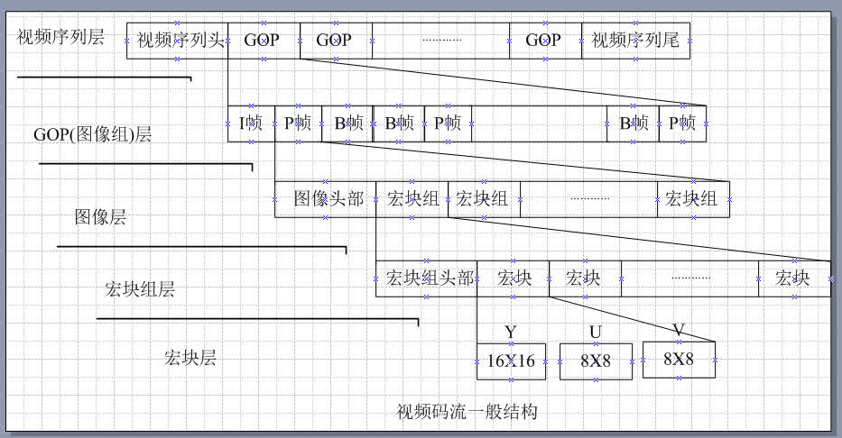
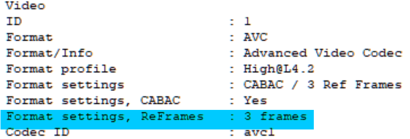
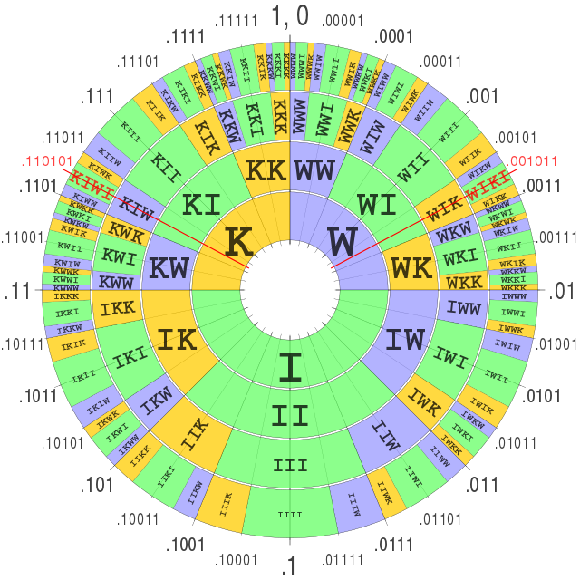
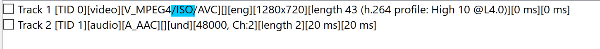

# 专有名词补充

> 本章主要介绍一些专业术语，专有名词
>
> 请用ctrl+f搜索关键词

---

## 解编码器

从广义上来说，编码是信息从一种形式或格式**转换为**另一种形式或格式的过程。解码，是编码的逆向。*加密也算是一种编码。*

==在这里我们主要解释数字音视频方面的解编码。==

**编码器(Encoder)**是一个电子元件、芯片、传感器、软件、算法或是将信息从一种格式或代码转换成另一种格式或代码的人。其主要目的是为了标准化、速度、压缩或加密。[^encoder]

**解码器(Decoder)**是一个电子元件，经常被用在单片机里面。用于将模拟信号视频转换成数字信号视频，其通常允许对视频特性的可编程控控制，如色温 锐度 亮度等。[^decoder]**解码器是编码器的反函数。**

*最常见的一个例子就是声卡与显卡*

==在这里提及的所有解编码器都是软件解编码器。==

[这里](https://www.wikiwand.com/en/List_of_codecs)有一份解编码器列表

### 视频解编码器

> 视频解编码器是指能编码或解码视频数字数据信息流的设备或计算机程序

- **FFmpeg**是一个免费开源的软件集，可以进行音频及视频的录制，转码，串流(直播)的功能。[^ffmpeg]其包含以下这些主要的函数库。

| 函数库名称 | 用途|
| :--------- | :------------------------- |
| libswresample[^libswresample]| 音频重采样|
| libavresample[^libavresample]                    | 音频重采样，来自libav分支，和上一个类似                      |
| libavcodec[^libavcodec]                          | 用于音视频解编码，所有的编码器从头构建，以确保最高效率       |
| libavformat*(Lavf)*[^libavformat][^libavformat2] | 用于音视频封装以及解封装                                     |
| libavutil[^libavutil]                            | 这是一个通用的辅助函数库，用于封装各部分都需要用到的函数，其包含了各种加解密算法以及压缩与解压缩算法 |
| libpostproc[^libpostproc]                        | 用于老的h.263视频后处理                                      |
| libswscale[^libswscale]                          | 用于视频以及图像缩放，像素长宽比的调整                       |
| libavfilter[^libavfilter]                        | 用于加载音视频滤镜                                           |

  以及以下这些命令行工具，他们的用法会在进阶中讲到

| 工具名            | 用途                                                         |
| ----------------- | ------------------------------------------------------------ |
| ffmpeg[^ffmpeg2]  | 用于转换音视频的格式，同时能够从视频采集设备采集视频并实时编码 |
| ffplay[^ffplay]   | 一个简单的多媒体播放器，以及ffmpeg的函数库                   |
| ffprobe[^ffprobe] | 用于分析多媒体信息                                           |

- **x264**是一个由VideoLAN开发的用于将视频流编码为**H.264/MPEG-4 AVC**格式的免费开源的软件函数库以及命令行工具[^x264]。*ffmpeg使用x264来解码H.264编码格式的多媒体流*。

- >**x265**是一个由MulticoreWare开发的用于将视频流编码为**H.265/HEVC**格式的基于**x264**修改的免费开源的软件函数库以及命令行工具[^x265]。*ffmpeg以及[UHDcode](https://www.wikiwand.com/en/MulticoreWare)使用x265来解码H.265编码格式的多媒体流*。

- **QuickTime**是一种由苹果公司开发的可拓展的多媒体框架，能够处理各种格式的数字音视频，图像，全景图像以及交互式媒体。[^QT]

- **libaom**由Alliance for Open Media开发并用于解编码AV1编码格式[^codec]。

- **libvpx**由Google开发并用于解编码VP9编码格式[^codec]

- **EVE** for VP9由twoorioles开发并用于解编码VP9编码格式[^evevp9]

- **DivX**是一个用于解编码**H.264/MPEG-4 AVC**的商业编码器，以其能将长时间的视频压缩成较小体积而质量较高而闻名[^divx]

- **Xvid**同上，但是是一个开源软件，是由一群原OpenDivX开发者在OpenDivX于2001年7月停止开发后自行开发的[^xvid]

---

### 音频解编码器

> 音频编解码器是指能编码或解码音频数字数据信息流的设备或计算机程序

- **ffmpeg**[^ffmpeg]

- **NeroAAC(Nero AAC Codec)**是一个用于解编码AAC格式(Advance Audio Coding)的免费工具集 [^neroaac]
- **QAAC(Quicktime AAC/ALAC Codec)**是一个基于Apple编码方式用于编码AAC以及ALAC的命令行工具[^qaac]，需要iTunes或者QuickTime的支持。
- **Fraunhofer FDK AAC(Fraunhofer FDK AAC Codec Library for Android)**是一个基于安卓系统开源并用于在安卓系统上解编码FDKAAC编码格式音频的函数库。[^fdkaacenc]
- **faac（Freeware Advanced Audio Coder）**是一个包含了用于编码AAC的FAAC以及用于解码的FAAD2的软件[^faac]
- **iTunes**是一个由苹果公司开发的多媒体播放器，多媒体库，网络，以及手机管理的软件。能够支持多种常见编码格式的播放。[^itunes]
- **Lame(LAME Ain't an MP3 Encoder)**是一个用于将音频转换为MP3编码格式的开源免费软件[^lame]
- **L3enc(raunhofer l3enc)**是第一个能将PCM(.wav)编码格式转换为MP3的软件，早期的安卓系统曾采用[^l3enc]
- **libopus**用于解编码Opus编码格式的音频[^codec]
- **libvobis**用于解编码viobs(.ogg)格式[^libvorbis]
- **WME(Windows Media Encoder)**不解释（

---

## 编码格式

==编码格式≠视频格式==

==编码格式≠容器格式==

编码格式是指一个多媒体流文件的编码方式，根据其编码的算法不同，其性能以及使用场景也不同。

### 视频编码格式

- **H.264/MPEG-4 AVC**[^h264]

  **H.264**，又称为**MPEG-4 Part10, Advanced Video Coding(AVC)**。是一种面向宏块，基于运动补偿的视频编码技术，到2014年已经成为高精度录制，压缩与发布最常用的格式之一。**H.264/AVC**项目的目的是为了创建一个更佳的视频压缩标准，在更低的比特率的情况下依然能够提供良好视频质量的标准。**H.264**的另外一个目标是提供足够的灵活性，以允许该标准能够应用于各种各样的网络和系统的各应用上，包括低和高比特率，低和高分辨率视频。H.264标准可以被视为由多个不同的应用框架 / 配置文件（profiles）组成的“标准系列”。

  **H.264**由**ITU-T**视频编码专家组(**ITU-T SG16 Q.6**)与**ISO/IEC**联合工作组(动态图像专家组 **Moving Picture Experts Group/MPEG**)共同组成的联合视频组**(JVT，Joint Video Team)**开发。因此因**ITU-T H.264**标准和**ISO/IEC MPEG-4/AVC**标准（正式名称是**ISO/IEC 14496-10—MPEG-4 Part 10，Advanced Video Coding**）有相同的技术内容，故被共同管理

  **H.264**的命名遵循了**ITU-T**的命名约定，它是VCEG视频编码标准H.26x线中的一员，**MPEG-4 AVC**的命名来自**ISO/IEC** MPEG的命名约定，它是ISO/IEC 14496的第10部分，该协议族被称为MPEG-4。该标准是作为VCEG和MPEG的一部分开发的，此前在ITU-T作为VCEG的项目，叫做H.26L。一些软件的内部标识此标准为**AVC1**

  其最大的分辨率达到`8192×4320`通常以`.264`为后缀名

- **H.265/HEVC(High Efficiency Video Coding)** 又被称为**H.265/MPEG-H Part2 HEVC** 是一种视频压缩标准，其被视为是**H.264**的继任者。和**H.264**为同一专家组开发。其在相同的视频质量下提供更高的压缩率，或者在相同的比特率下有更好的视频质量。**H.265**正在与**IETC**开发的[**AV-1**](EX_words#AV1)编码竞争标准化。现在被各大压片组所采用。通常以`.265`为后缀名。

- **vp8**是由On2 Technologies开发后由Google放出的开源编译格式，其与H.264相比，需要约213%的体积才能达到同样的质量。通常被封装于`webm`容器中。[^vp8]

- **vp9**是Google开发的与H.265竞争的免费开源编码格式。最大可达8192x4352@120，与HEVC相比更适合用于网络传输，因为几乎所有浏览器都支持解码VP9，而在压缩比上，在相同质量下比H.264少40%~45%的体积，比HEVC少20%的体积。主要被用于Youtube上，通常与Opus音频格式一起被封装于`webm`容器中[^vp9]

- **AV1(AOMedia Video 1)**是由**AOMedia**开发的免费开源编码格式，是一种基于宏块但也同时加入频率变换格式的编码技术。其主要使用的技术来源于**Google**下一代视频压缩格式**VP10**，但同时包含了**Mozilla**的**Daala**视频压缩格式以及由**Cisco**开发的**Thor**视频压缩格式中的编码技术。**Google**决定将其并入**AOMedia**开发标准。到目前为止，在相同质量下比**HEVC**少20%的体积，比**AVC**少50%的体积，目前在Youtube上进行小规模测试中，其最大可支持`7680x4320@120`，通常被封装于`webm`容器中[^AV1]。是**HEVC** **AVS2**的竞争对象。

- **AVS(Audio Video coding Standard)**，数码音视频编码技术标准，是由中国开发的视频压缩技术，目前在中央电视台，安徽卫视，湖南卫视上使用。AVS2即第二代，支持分辨率，高动态范围的高效压缩，压缩效率比**AVC**提升一倍，超过**HEVC**。AVS2还支持三维视频、多视角和虚拟现实视频的高效编码；立体声、多声道音频的高效有损及无损编码；监控视频的高效编码。但是缺少可用的软件编解码器，普及性低（因为不开源，你又不开源，又不免费，除了国家电视台谁用）。[^AVS]

- **Daala**是一种由Xpih,Mozilla,IETF开发的开源视频编码格式，目前其技术被用于AV-1的开发

- **Thor**是一种由Cisco开发的免费视频编码格式，目前其技术被用于AV-1的开发

### 音频编码格式

- **WAV(Waveform Audio File Format)**是一个由微软及IBM开发的无压缩数字音频编码格式。注意，**无压缩≠无损**。就像你把棉被塞到仓库里面，如果棉被本来就是坏的那拿出来还是坏的。通常以`.wav`为后缀名
- **ALAC(Apple Lossless Audio Codec)**是一个由苹果公司开发的无损压缩数字音频解编码格式，其能将`FLAC` `WAV`等的无压缩格式转换成无损压缩格式。[^alac]通常以`.alac`为后缀名
- **Monkey's Audio(APE)**，是一种由Matthew T. Ashland开发的免费开源编码格式，是常见的无损音讯压缩编码格式，通常以`.ape`为后缀名。
- **AAC(Advance Audio Codec)**是一种由MPEG开发的免费开源的破坏性音频压缩编码格式。有庞大的分支，这里介绍几个常见的。通常以`.m4a`为后缀名[^aac]
  - **AAC(MPEG-2 Part 7)**使用MPEG-2 Audio Transport Stream容器封装，常见后缀为`.aac`
  - **AAC(MPEG-4 Part3 shubpart4)**
    - **HE-AAC(High-Efficiency AAC)**即高效AAC，适用于低码率的情况下，在低码率的情况下其能取得更好的音质，其宣称在48kbps的音质可以比128kbps的MP3还好
    - **AAC-LD(AAC-Low Delay)**主要被用于网络传输
    - **AAC-LC(AAC-Low Complexity)**比较简单，没有了增益控制，但提高了编码效率
- **Opus**是一种由IETF编码工作组开发的开源免费有损音频编码格式，目标是希望用单一格式包含声音和语音，取代Speex和Vorbis，且适用于网路上低延迟的即时声音传输。比MP3 AAC有更低的延迟和更好的声音压缩率。通常以`.opus`为后缀名，通常被封装在`webm`容器中[^opus]
- **Vorbis**是一种由Xiph.Org基金会开发的免费开源的有损音频编码，目前Xiph.Org基金会建议使用延迟更低、音质更好的**Opus**编码来取代**Vorbis**，通常被封装在`ogg`容器中[^vorbis]
- **WMA(Windows Media Audio)**由Mircosoft开发的无损音频编码格式,WMA 7之后的WMA支持证书加密，未经许可（即未获得许可证书），即使是非法拷贝到本地，也是无法收听的。由于其有专利版权，所以……嗯……。通常以`.wma`为后缀名[^wma]
- **PCM(Pulse-code modulation)**即脉冲编码调变。以数字信息记录模拟信号，这样的到的音频信号会清楚且能用于分时多工系统(如现代的公共电话)，但是体积较大。通常以`.pcm`为后缀名[^pcm]
- **FLAC(Free Lossless Audio Codec)**是一个免费开源的无损压缩数字音频编码格式。通常以`.flac`为后缀名[^flac]
- **AC3(Audio Codec 3,Advanced Codec 3,Acoustic Coder 3** *[这里区分一下， Adaptive Transform Acoustic Coding 3 是一种由索尼开发的格式]*)**是指杜比数字编码(Dolby Digital 或称AC-3)**。通常被封装在`VOB`或`MPEG-TS`容器中[^ac3]
- **MP3(formally MPEG-1 Audio Layer III, MPEG-2 Audio Layer III)**是一种有损压缩数字音频编码格式。通过舍弃对人类听觉不重要的数据通常以降低体积，`.mp3`为后缀名[^mp3]

---

## 封装格式

[这里](https://www.wikiwand.com/en/Comparison_of_video_container_formats)有一份视频容器表

封装格式，你可以理解为文件后缀名，就是那些`.mp4` `.avi`的东西

形象点就是不同的行李箱能装的东西不同以及装东西的方式不同

| 容器                         | 后缀      | 描述                                                         | 可封装内容                                                   |
| ---------------------------- | --------- | ------------------------------------------------------------ | ------------------------------------------------------------ |
| MPEG-4 Part 14[^mp4]         | .mp4      | .m4a为仅音频，封装AAC或ALAC  .m4v为仅视频                | 视频：H.265 H.264 MPEG-4 Part 2   音频：MPEG-4 Part 3 audio objects 如MP3 ALS SLS等 MP2 MP1等也支持 |
| FlashVideo[^flv]             | .flv/.f4v | flv是一种数码多媒体文件封装格式，广泛用于电影等。目前仍被用于某些使用FlashPlayer的网站上 | 视频：H.264 音频：MP3 AAC                                |
| Audio Video Interleave[^avi] | .avi      | 是Mircosoft在1992年推出的一种多媒体封装格式，支持多视频流与多音频流，但是由于其索引文件放在尾部，所以不适用于网络传输，已经较少用到 | 几乎所有                                                     |
| Matroska[^mkv]               | .mkv      | Matroska Multimedia Container是一种开源免费的视频容器，被广泛用于多语言视频传输 | 几乎所有                                                     |
| WebMedia[^webm]              | .webm     | Webm是由On2 Xiph Matroska Google共同开发的用于HTML5的开源免费视频封装格式，图像文件是WebP，其基于Matroska(MKV)开发而成 | 视频：H.264 H.265 VP8,9 AV1 音频: Vorbis OPus aac         |
| RealMedia[^rm]               | .rm/.rmvb | rm被用于早期的网络传输，可以提供更加优秀的压缩体积。后来推出了支持可变码率的rmvb。RealMedia HD可以在更高的视觉质量下提供比高效率视频编码更高的压缩率 | 符合MPEG标准的多媒体                                         |
| Video Object[^vob]           | .vob      | vob用于在DVD中封装数字音视频以及字幕文件，常与IFO BUP文件配合使用 | MPEG-PS                                                      |
| QuickTime[^QT]               | .qt/.mov  | 是一种由苹果公司开发的多媒体框架，能够处理数字音视频，动画等格式。其为H.264标准的一个基础，可以使用插件的方式来支持其他解码器(如DivX)。 | 音频：FLAC MIDI MP3等 视频：GIF H.264 H.265 qtmov等      |
| MPEG-TS[^meeg-ts]            | .ts/.m2ts | 由于TS能支持从任意地方开始播放，也就是说你只有中间一截也能播放，所以是一种被广泛用于蓝光碟，IPTV，DVB，直播等地方的视频容器 | 符合MPEG标准的多媒体，VC-1，AAC等                            |

---

## 视频名词

> 理解难度从上往下递增

- **帧率(Frame per Second(FPS))**由于视觉暂留尚未研究透彻，目前学术界广泛接受的一个观点是帧率高于10~12帧的时候就会认为是连贯的画面[^fsp]

- **逐行扫描(Progressive scan)**1080p中的p就是逐行扫描的意思，顾名思义。[^P]

- **隔行扫描(Interlaced scan)**顾名思义[^I]

  引用wiki上的图来解释，先扫描的叫上(奇)场，后扫描的叫下(偶)场，在这里就不解释什么交错鬼影，四比三下位变换之类的了。

  

- **像素长宽比(Aspect ratio)**用来描述画面的长宽比的。传统电视为4:3（1.33:1）。HDTV为16:9（1.78:1）。35mm胶片为1.37:1。 电脑上的显示屏幕多为1:1，但是数字视频不是。[^video]

- **色彩空间(Color Space)**规定了色彩的显现区域。在视频中常用的为ITU BT.601 ITU BT.709 IEC 619966-2-4 YCbCr YUV。其中各种定义，色彩构成解释起来很复杂，这里只能简单地说一下，展开来说又是一章(吐血.gif)。现在主要使用的为YUV 4:2:0以及BT.709，除了有个别远古视频。[^color]

- **CBR(Constant Bit Rate)**即固定码率。在早期的低带宽的情况下适用，因为需要节省带宽，所以强行把高码率压低。CBR也被用于蓝光DVD中，因为那么大空间，不用白不用，所以就把它用CBR调个很高的数值填满就是了。这种编码方式缺乏变化，不太适用于现在的网络传输。[^cbr]

- **VBR(Variable bitrate)**即可变码率。在较高带宽的网络下适用，画面变动不大时码率低，画面变动大时码率高。目前被广泛用于媒体流传输服务。[^vbr]

- **ABR(Average bitrate)**即平均码率，用于计算文件大小，同时作为一个衡量视频质量的指标

- **CVBR(Constrained Variable Bitrate)**，这个不好翻译。是一种将CBR和VBR结合起来的技术，在一段时间内维持在设定的码率不变，但在变动大的时候可以超过这个设定的码率。[^cvbr]

- **2pass**即编码两次，第一次不进行实际压缩，只收集视频的统计信息，第二次根据第一次收集到的信息进行压缩，为压制中比较常用的一种压制方法。在此之上还有3pass

- **tbn** = the **T**ime **B**ase in AVStream that has come from the co**n**tainer(来自视频容器所描述的视频时基)

- **tbc** = the **T**ime **B**ase in AVCodecContext for the **C**odec used for a particular stream(来自视频流的视频编码器所使用的时基)

- **tbr** = tbr is guessed from the video stream and is the value users want to see when they look for the video frame rate(tbr是从视频流本身进行猜测，他是视频的在观看时候的实际帧率)

- **H.264 profile**即配置文件，其针对不同的应用程序定义了不同的配置，这些被声明为配置文件代码(`profile_idc`)和在编码器种应用的一系列约束。这允许解码器识别解码该特定流的要求。一般来说有以下这些[^profile]

  > constraint 约束
  >
  > Progressive 渐进
  >
  > Predictive 前向预测性

  *对非可适性视频编码而言，H.264有以下这些标准*

  - **Constrained Baseline Profile** (CBP, 66 with constraint set 1)

    主要被用于低开销的应用场景，这种等级的profile通常被用于视频会议以及一些手机应用。他是BP MP HP之间的共有特征子集

  - **Baseline Profile** (BP, 66, 基线)

    主要被用于需要额外数据以保持数据传输[鲁棒性](#鲁棒性)的低开销应用场景，有时候在一些视频会议和手机应用中使用。该等级的配置在CBP的基础上增加了三个功能以保证传输稳定(或是用于其他目的例如低延迟多点的视频流合成)。自从2009年CBP被定义以来，该配置文件的重要性逐渐消失，所有CBP流也被视为BP流，所以共享相同的标识码(66)

  - **Extended Profile** (XP, 88, 额外)

    被用于视频流文件，这个配置文件有相对较高的压缩能力以及一些额外的功能来确保对数据丢失和服务器媒体流切换的鲁棒性

  - **Main Profile** (MP, 77, 主要)**常用**

    被用于使用DVB标准中定义的MPEG-4格式的标清数字电视广播。然而它并不用于高清电视广播，因为在2004年针对高清电视广播开发HiP之后，该配置文件的重要性已经消失。

  - **High Profile** (HiP, 100, 高)**常用**

    主要用于广播以及储存的配置文件，尤其是高清电视以及蓝光DVD

  - **Progressive High Profile** (PHiP, 100 with constraint set 4)

    同上，但不支持字段编码

  - **Constrained High Profile** (100 with constraint set 4 and 5)

    同上，但不支持B帧切片

  - **High 10 Profile** (Hi10P, 110)

    基于HiP，并支持10bit采样精度

  - **High 4:2:2 Profile** (Hi422P, 122)

    主要针对隔行扫描的配置文件，建立在Hi10P之上，增加对4:2:2色度的支持，同时每个解码图像的采样精度最多10bit

  - **High 4:4:4 Predictive Profile** (Hi444PP, 244)

    在上一个基础之上建立，支持4:4:4的色度采样，每个采样升到14bit，并且增加对高效快编码的支持以及可以将每个图像编码为三个独立的色彩平面(Y U V)

  > 下面这四个配置文件主要被用于录像以及专业的编辑程序，包含四个额外的仅节点配置文件。

  - **High 10 Intra Profile** (110 with constraint set 3)
  - **High 4:2:2 Intra Profile** (122 with constraint set 3)
  - **High 4:4:4 Intra Profile** (244 with constraint set 3)
  - **CAVLC 4:4:4 Intra Profile** (44)

  > 对适应性视频编码( Scalable Video Coding, SVC)而言，包含了五个额外的额外的可适应性配置文件，被定义为与普通配置文件的组合，由标识码中的第二个字标识

  - **Scalable Baseline Profile** (83)

    在BP上增加可适应性功能

  - **Scalable Constrained Baseline Profile** (83 with constraint set 5)

    主要用于实时通讯

  - **Scalable High Profile** (86)**常用**

    主要用于广播以及流媒体传输应用

  - **Scalable Constrained High Profile** (86 with constraint set 5)

    对上一个增加了对实时通讯应用的功能

  - **Scalable High Intra Profile** (86 with constraint set 3)

    同上，限节点使用

  wiki上关于各配置文件支持的功能列表

| 特性                                               | CBP   | BP    | XP    | MP    | ProHiP | HiP   | Hi10P   | Hi422P         | Hi444PP                 |
| -------------------------------------------------- | ----- | ----- | ----- | ----- | ------ | ----- | ------- | -------------- | ----------------------- |
| 位深度                                             | 8     | 8     | 8     | 8     | 8      | 8     | 8 to 10 | 8 to 10        | 8 to 14                 |
| 色度格式                                           | 4:2:0 | 4:2:0 | 4:2:0 | 4:2:0 | 4:2:0  | 4:2:0 | 4:2:0   | 4:2:0 4:2:2 | 4:2:0 4:2:2 4:4:4 |
| 可调整宏块排列(Flexible macroblock ordering (FMO)) | No    | Yes   | Yes   | No    | No     | No    | No      | No             | No                      |
| 任意性排序(Arbitrary slice ordering (ASO))         | No    | Yes   | Yes   | No    | No     | No    | No      | No             | No                      |
| 冗余切片(Redundant slices (RS))                    | No    | Yes   | Yes   | No    | No     | No    | No      | No             | No                      |
| 数据分区                                           | No    | No    | Yes   | No    | No     | No    | No      | No             | No                      |
| SI 与 SP 切片                                      | No    | No    | Yes   | No    | No     | No    | No      | No             | No                      |
| 隔行扫描编码(PicAFF, MBAFF)                        | No    | No    | Yes   | Yes   | No     | Yes   | Yes     | Yes            | Yes                     |
| B 切片                                             | No    | No    | Yes   | Yes   | Yes    | Yes   | Yes     | Yes            | Yes                     |
| CABAC                                              | No    | No    | No    | Yes   | Yes    | Yes   | Yes     | Yes            | Yes                     |
| 4:0:0 单色度                                       | No    | No    | No    | No    | Yes    | Yes   | Yes     | Yes            | Yes                     |
| 8×8 vs. 4×4 变化适应性                             | No    | No    | No    | No    | Yes    | Yes   | Yes     | Yes            | Yes                     |
| 量化缩放矩阵                                       | No    | No    | No    | No    | Yes    | Yes   | Yes     | Yes            | Yes                     |
| 分离 $$C_b$$ 以及 $$C_r$$ QP 控制                  | No    | No    | No    | No    | Yes    | Yes   | Yes     | Yes            | Yes                     |
| 分离色彩平面                                       | No    | No    | No    | No    | No     | No    | No      | No             | Yes                     |
| 预测性无损编码                                     | No    | No    | No    | No    | No     | No    | No      | No             | Yes                     |

- **H.264 等级(level)**

  规定了一系列的约束以及告诉解码器所需要的配置等级

| Level | 最大解码速率(宏块/秒) | 每个宏块的最大帧大小 | 视频编码层的最大比特率(kbits/s)   (Constrained Baseline,  Baseline, Extended and Main Profiles) | 高解析度@ 最高比特率 (最大储存帧)                        | 最大图片缓存 |
| :---: | :-------------------- | :------------------- | :----------------------------------------------------------- | :----------------------------------------------------------- | :----------- |
|   1   | 1,485                 | 99                   | 64                                                           | 128×96@30.9 (8) 176×144@15.0 (4)                          | 396          |
|  1b   | 1,485                 | 99                   | 128                                                          | 128×96@30.9 (8) 176×144@15.0 (4)                         | 396          |
|  1.1  | 3,000                 | 396                  | 192                                                          | 176×144@30.3 (9)  320×240@10.0 (3) 352×288@7.5 (2)   | 900          |
|  1.2  | 6,000                 | 396                  | 384                                                          | 320×240@20.0 (7) 352×288@15.2 (6)                        | 2376         |
|  1.3  | 11,880                | 396                  | 768                                                          | 320×240@36.0 (7) 352×288@30.0 (6)                        | 2376         |
|   2   | 11,880                | 396                  | 2,000                                                        | 320×240@36.0 (7) 352×288@30.0 (6)                        | 2376         |
|  2.1  | 19,800                | 792                  | 4,000                                                        | 352×480@30.0 (7) 352×576@25.0 (6)                        | 4752         |
|  2.2  | 20,250                | 1,620                | 4,000                                                        | 352×480@30.7 (12)  352×576@25.6 (10)  720×480@15.0 (6) 720×576@12.5 (5) | 8100         |
|   3   | 40,500                | 1,620                | 10,000                                                       | 352×480@61.4 (12)  352×576@51.1 (10)  720×480@30.0 (6) 720×576@25.0 (5) | 8100         |
|  3.1  | 108,000               | 3,600                | 14,000                                                       | 720×480@80.0 (13)  720×576@66.7 (11) 1,280×720@30.0 (5) | 18000        |
|  3.2  | 216,000               | 5,120                | 20,000                                                       | 1,280×720@60.0 (5) 1,280×1,024@42.2 (4)                  | 20480        |
|   4   | 245,760               | 8,192                | 20,000                                                       | 1,280×720@68.3 (9)  1,920×1,080@30.1 (4) 2,048×1,024@30.0 (4) | 32768        |
|  4.1  | 245,760               | 8,192                | 50,000                                                       | 1,280×720@68.3 (9)  1,920×1,080@30.1 (4) 2,048×1,024@30.0 (4) | 32768        |
|  4.2  | 522,240               | 8,704                | 50,000                                                       | 1,280×720@145.1 (9)  1,920×1,080@64.0 (4) 2,048×1,080@60.0 (4) | 34816        |
|   5   | 589,824               | 22,080               | 135,000                                                      | 1,920×1,080@72.3 (13)  2,048×1,024@72.0 (13)  2,048×1,080@67.8 (12)  2,560×1,920@30.7 (5) 3,672×1,536@26.7 (5) | 110400       |
|  5.1  | 983,040               | 36,864               | 240,000                                                      | 1,920×1,080@120.5 (16)  2,560×1,920@51.2 (9)  3,840×2,160@31.7 (5)  4,096×2,048@30.0 (5)  4,096×2,160@28.5 (5) 4,096×2,304@26.7 (5) | 184320       |
|  5.2  | 2,073,600             | 36,864               | 240,000                                                      | 1,920×1,080@172.0 (16) 2,560×1,920@108.0 (9) 3,840×2,160@66.8 (5)  4,096×2,048@63.3 (5)  4,096×2,160@60.0 (5) 4,096×2,304@56.3 (5) | 184320       |
|   6   | 4,177,920             | 139,26               | 240,000                                                      | 3,840×2,160@128.9 (16) 7,680×4,320@32.2 (5) 8,192×4,320@30.2 (5) | 696320       |
|  6.1  | 8,35,840              | 139,264              | 480,000                                                      | 3,840×2,160@257.9 (16) 7,680×4,320@64.5 (5) 8,192×4,320@60.4 (5) | 696320       |
|  6.2  | 16,711,680            | 139,264              | 800,000                                                      | 3,840×2,160@300.0 (16) 7,680×4,320@128.9 (5) 8,192×4,320@120.9 (5) | 696320       |

- **解码图像缓存器（Decoded picture buffering, DPB）**

    **H.264/AVC**编码器采用之前已编码的帧画面来提供给其他帧画面进行样本值预测。这可以使得编码器对编码给定帧画面的最佳方式做出有效决策。同时，参考帧(Ref Frames)也来自于这个缓存在解码器中这些帧被储存在DPB中，DPB的最大容量(单位：帧)，如上一个表中的括号，可以按照下面的方式来计算

    $$DpbCapacity=\lfloor \frac {最大帧缓存量(Mb/s)} {(帧画面宽度(Mb/s)))*(帧画面高度(Mb/s))})\rfloor $$

    其中MaxDpbMbs为上表中最后一列的数字，举个例子，有一个1920(120Mb/s)x1080(68Mb/s)的HDTV的图像，根据Level 4 中所规定的MaxDpb计算

    $$\lfloor \frac {32768} {120*68})\rfloor = 4帧$$

    注意，正在解码的图像不包括在DPB的计算中

    你可以在mediainfo中看见下图信息

    

- **B帧 I帧 P帧**[^vcpt] **相邻在这里表示在编码关系上相邻，在播放顺序上两帧未必相邻**

    - **I帧(I-frames, Intra-coded picture)** 是压缩最弱体积最大的一种帧，但是其解码不需要依靠其他帧，所以被叫做关键帧，快进的时候会用到。通常是一幅完整的图片。
    - **B帧(B-frames, Bidirectional predicted picture)**是双向预测帧，能够根据前后两帧的数据来进行重建，是压缩最高体积最小的一种帧，但是需要依赖其他帧的信息进行解码。因为只记录相邻前后两帧之间的差异，所以可以节省更多空间
    - **P帧(P-frames, Predicted Picture)**是后向预测帧，能够根据上一帧的信息来进行解码，压缩能力比I帧强比B帧弱。只记录与前一帧之间的差别。

- **运动补偿(Motion compensation)**是一种描述相邻帧差别的方法，具体来说是描述前面一帧（相邻在这里表示在编码关系上的前面，在播放顺序上未必在当前帧前面）的每个小块怎样移动到当前帧中的某个位置去。可被用于去交错以及运动插值。又分为全局运动补偿，分块运动补偿，可变分块运动补偿以及重叠分块运动补偿。[^motion]

- **宏块(Macroblock)**是运动预测的基本单位，一张完整的帧画面通常会被切割成几个大区快[^marco]

- **熵编码(entropy encoding)**在信息学上来说是一种不依赖媒介具体特征的接近无损的数据压缩方式，熵编码通常与其他编码方式结合使用。[^entropyEnc]一种主要类型的熵编码方式是在输入的时候创建并分配一个唯一的**无首位代码(prefix-free code)**

- **前缀码(Prefix code)**是一种编码系统，通常为长度可变的，在其中的每一个前缀码都具备前置性质(prefix property)。也就是说，该编码是独立唯一且不能被其他编码所作为前置部分的，举个例子，编码集合`{1,32,75}`具备前置性质，但`{1,3,7,32,75}`不具备，因为`3`和`7`可以分别作为`32`与`75`的前置编码。这种被叫做无首位编码(PFC, prefix-free codes)。

  每一个前置码都是解码结果唯一的：给定完整准确的序列，接收方可以识别每个单词而不需要编码与单词之间做特殊标记。但是有解码结果唯一的代码不是前缀码; 例如，将前缀码进行逆转操作`(45->54)`仍然是解码结果唯一的（它是后缀代码），但它不一定是前缀代码。

  霍夫曼编码是该编码系统中的一种算法。[^prefixcode]

- **算术编码(Arithmetic Coding)**是一种无损数据压缩方式，同时也是一种熵编码的算法。[^算术编码]这个是一个完整的算法，可以单独开一章，这里就简单的说一下。算术编码是不同于其他熵编码的编码算法，其他的熵编码方法通常是把输入的消息分割为符号，然后对每个符号进行编码，而算术编码是直接把整个输入的消息编码为一个数，一个满足（0.0 ≤ *n* < 1.0）的小数n。举个简单的例子

  以`wiki`这一个字符串为例，一共有四个字符，使用二进制区间表示(00,01,10,11)

  - w: 25% [0,0.25) ==>[0.00,0.01)
  - i: 50% [0.25,0.75) ==>[0.01,0.11)
  - k: 25% [0.75,1) ==>[0.11,1.00)

  那么序列`ww`出现的区间是`[0,0.01*0.01)`，`wi`出现的区间是`[0.0001,0.01*0.11+0.0001)`，`wk`出现的区间是`[0.0011,0.01)`。依此类推，可以算出，`wik`出现的区间是`[0.00101，0.0011)`，`wiki`出现的区间是`[0.001011,0.0010101)`，我们使用`0.001011`作为其编码，可以轻易地逆向。

  下图采用自[维基百科](https://www.wikiwand.com/en/Arithmetic_coding)

  

- **CABAC(Context-based Adaptive Binary Arithmetic Coding)**[^cabbc]，即前文参考性自适应二元算术编码，是一种基于算术编码的在HEVC以及AVC编码中使用的熵编码方式。其分为三部分`Binarizer(二值化算法)` `Context Modeler(上下文模型)` `Arithmetic Coding Engine(算术编码引擎)` 。他首先将所有非二进制符号转换为二进制，编码器遍历每个比特来选择使用哪个概率模型，然后根据上下文信息来优化概率估计。最后用算术编码来压缩数据。[^cabbc]通常比CAVLC性能更佳。但不支持Baseline以及Extended profiles。

- **CAVLC(Context-based Adaptive Variable-Length code)**，适应性可变长度编码法，又被称为`UVLC`。是h.264的演算法机制，其对传统的霍夫曼编码进行了改进，因此在压缩效率上取得了相当大的进步。其支持所有的H.264 peofile。过程解释有点复杂（[^cavlc]

- **适应性视频编码(Scalable Video Coding, SVC)**是传统H.264编码的延伸，是H.264视频压缩标准附录G的名称，可以提升更大的编码弹性，并且有时间(帧速率)可适性(Temporal Scalability),空间(图片大小)可适性（Spatial Scalability）及信噪比/质量/品质可适性（SNR Scalability）[^ensvc][^cnsvc]三大特性，使得视频传输能在不同的网络带宽中使用。

## 音频名词

## 其他名词

- **ISO(International Organization for Standardization)**即国际化标准组织。其制定了一系列标准，包括但不限于电影播放，视频播放，文字，食品。

  

  这里的ISO表示的是遵循着`ISO/IEC 14496`标准

- **IEC(International Electrotechnical Commission)**国际电工协会，主要负责电气工程以及电子工程的国际标准制定

- **ITU-T(ITU Telecommunication Standardization Sector)**即国际电信联盟电信标准化部门。其制定了一系列用于远程通讯传输的多媒体标准，其中包括`ITU-T H.264`等

- **ITU-R(ITU Radiocommunication Sector)**国际电信联盟无线电通信部门

- `鲁棒性(robustness)`，是指==控制系统在一定(结构，大小)的**参数扰动下**，仍能够维持其他某些性能的特性==，也就是系统的健壮性。鲁棒控制方法适用于稳定性和可靠性作为首要目标的应用，同时过程的动态特征已知，且不确定因素的变化范围可以预估。**鲁棒性不同于稳定性**，稳定性是指==控制系统在使它偏离平衡状态的**扰动消失之后** ，返回原来平衡状态的能力==。举个例子，鲁棒性就像你种菜(物理)的时候，不会因为某一天浇水多了抑或少了，某一天出太阳了或下雨了而长不出来。稳定性就你给弹簧一个压力，你放手之后弹簧能回到原来的状态

- `MPEG(Moving Picture Expert Group)`动态图像专家组，制定了一系列有关动态图像的标准，如编码格式，音频，容器，传输方式等等

---

##脚注

[^codec]: [Wiki-Codec](https://www.wikiwand.com/en/List_of_codecs)
[^ffmpeg]: [Wiki-FFmpeg](https://www.wikiwand.com/en/FFmpeg): **FFmpeg** is a [free software](https://www.wikiwand.com/en/Free_software) project consisting of a vast software suite of [libraries](https://www.wikiwand.com/en/Library_(computing)) and [programs](https://www.wikiwand.com/en/Computer_program) for handling video, audio, and other [multimedia](https://www.wikiwand.com/en/Multimedia) files and streams.
[^ffmpeg2]: [Wiki-FFmpeg](https://www.wikiwand.com/en/FFmpeg): *ffmpeg* is a command-line tool that converts audio or video  formats. It can also capture and encode in real-time from various  hardware and software sources such as a TV capture card.
[^ffplay]: [Wiki-FFmpeg](https://www.wikiwand.com/en/FFmpeg): *ffplay* is a simple media player utilizing [SDL](https://www.wikiwand.com/en/Simple_DirectMedia_Layer) and the FFmpeg libraries.
[^ffprobe]: [Wiki-FFmpeg](https://www.wikiwand.com/en/FFmpeg): *ffprobe* is a command-line tool to display media information (text, [CSV](https://www.wikiwand.com/en/Comma-separated_values), [XML](https://www.wikiwand.com/en/XML), [JSON](https://www.wikiwand.com/en/JSON)), see also [Mediainfo](https://www.wikiwand.com/en/Mediainfo).
[^libswresample]: [Wiki-FFmpeg](https://www.wikiwand.com/en/FFmpeg): *ibswresample* is a library containing audio [resampling](https://www.wikiwand.com/en/Resampling_(audio)) routines.
[^libavresample]: [Wiki-FFmpeg](https://www.wikiwand.com/en/FFmpeg): *libavresample* is a library containing audio resampling routines from the [Libav](https://www.wikiwand.com/en/Libav) project, similar to *libswresample* from *ffmpeg*.
[^libavcodec]: [Wiki-FFmpeg](https://www.wikiwand.com/en/FFmpeg): *libavcodec*is a library containing all of the native FFmpeg audio/video encoders and decoders. Most codecs were developed from scratch to ensure best performance and high code reusability.
[^libavformat]: [Wiki-FFmpeg](https://www.wikiwand.com/en/FFmpeg): *libavformat* (Lavf)is a library containing demuxers and muxers for audio/video container formats.
[^libavformat2]: ["FFmpeg: Lavf: I/O and Muxing/Demuxing Library"](https://www.ffmpeg.org/doxygen/2.2/group__libavf.html). *ffmpeg.org*. Retrieved 21 October 2016.
[^libavutil]: [Wiki-FFmpeg](https://www.wikiwand.com/en/FFmpeg): *libavutil* is a helper library containing routines common to different parts of FFmpeg. This library includes hash functions ([Adler-32](https://www.wikiwand.com/en/Adler-32), [CRC](https://www.wikiwand.com/en/Cyclic_redundancy_check), [MD5](https://www.wikiwand.com/en/MD5), [RIPEMD](https://www.wikiwand.com/en/RIPEMD), [SHA-1](https://www.wikiwand.com/en/SHA-1). [SHA-2](https://www.wikiwand.com/en/SHA-2), [MurmurHash](https://www.wikiwand.com/en/MurmurHash)3, [HMAC](https://www.wikiwand.com/en/Hash-based_message_authentication_code) MD-5, HMAC SHA-1 and HMAC SHA-2), ciphers ([DES](https://www.wikiwand.com/en/Data_Encryption_Standard), [RC4](https://www.wikiwand.com/en/RC4), [AES](https://www.wikiwand.com/en/Advanced_Encryption_Standard), AES-CTR, [TEA](https://www.wikiwand.com/en/Tiny_Encryption_Algorithm), [XTEA](https://www.wikiwand.com/en/XTEA), [Blowfish](https://www.wikiwand.com/en/Blowfish_(cipher)), [CAST-128](https://www.wikiwand.com/en/CAST-128), [Twofish](https://www.wikiwand.com/en/Twofish) and [Camellia](https://www.wikiwand.com/en/Camellia_(cipher))), [LZO](https://www.wikiwand.com/en/Lempel–Ziv–Oberhumer) decompressor  and [Base64](https://www.wikiwand.com/en/Base64) encoder/decoder.
[^libpostproc]: [Wiki-FFmpeg](https://www.wikiwand.com/en/FFmpeg): *libpostproc* is a library containing older h263 based [video postprocessing](https://www.wikiwand.com/en/Video_postprocessing) routines.
[^libswscale]: [Wiki-FFmpeg](https://www.wikiwand.com/en/FFmpeg): *libswscale* is a library containing video [image scaling](https://www.wikiwand.com/en/Image_scaling) and [colorspace](https://www.wikiwand.com/en/Color_space)/pixelformat conversion routines.
[^libavfilter]: [Wiki-FFmpeg](https://www.wikiwand.com/en/FFmpeg): *libavfilter* is the  substitute for vhook which allows the video/audio to be modified or  examined between the decoder and the encoder. Filters have been ported  from many projects including [MPlayer](https://www.wikiwand.com/en/MPlayer) and [avisynth](https://www.wikiwand.com/en/Avisynth)
[^x264]: [Wiki-X264](https://www.wikiwand.com/en/X264): **x264** is a [free and open-source](https://www.wikiwand.com/en/Free_and_open-source_software)[software library](https://www.wikiwand.com/en/Library_(computing)) and a [command-line](https://www.wikiwand.com/en/Command-line_interface) utility developed by [VideoLAN](https://www.wikiwand.com/en/VideoLAN) for encoding video streams into the [H.264/MPEG-4 AVC](https://www.wikiwand.com/en/H.264/MPEG-4_AVC) format.
[^x265]: [Wiki-X265](https://www.wikiwand.com/en/X265): **x265** is a [library](https://www.wikiwand.com/en/Library_(computing)) for encoding video into the [High Efficiency Video Coding](https://www.wikiwand.com/en/High_Efficiency_Video_Coding) (HEVC/H.265) [video compression](https://www.wikiwand.com/en/Video_compression) format
[^QT]: [Wiki-QuickTime]:(https://www.wikiwand.com/en/QuickTime): **QuickTime** is an extensible [multimedia framework](https://www.wikiwand.com/en/Multimedia_framework) developed by [Apple Inc.](https://www.wikiwand.com/en/Apple_Inc.), capable of handling various formats of [digital video](https://www.wikiwand.com/en/Digital_video), picture, sound, [panoramic images](https://www.wikiwand.com/en/QuickTime_VR), and [interactivity](https://www.wikiwand.com/en/Interactivity). 
[^evevp9]: [twoorioles](https://www.twoorioles.com/eve-for-vp9)
[^dvix]: [Wiki-DivX](https://www.wikiwand.com/en/DivX): **DivX** is a brand of [video codec](https://www.wikiwand.com/en/Video_codec) products developed by DivX, LLC. The DivX codec gained fame for its ability to [compress](https://www.wikiwand.com/en/Video_compression) lengthy video segments into small sizes while maintaining relatively high visual quality. There are three DivX [codecs](https://www.wikiwand.com/en/Codec); the original [MPEG-4 Part 2](https://www.wikiwand.com/en/MPEG-4_Part_2) DivX codec, the [H.264/MPEG-4 AVC](https://www.wikiwand.com/en/H.264/MPEG-4_AVC) DivX Plus HD codec and the [High Efficiency Video Coding](https://www.wikiwand.com/en/High_Efficiency_Video_Coding) DivX HEVC Ultra HD codec. 

[^xvid]: [Wiki-Xvid](https://www.wikiwand.com/en/Xvid): **Xvid** (formerly "**XviD**") is a [video codec](https://www.wikiwand.com/en/Video_codec)[library](https://www.wikiwand.com/en/Library_(computing)) following the [MPEG-4](https://www.wikiwand.com/en/MPEG-4)[video coding standard](https://www.wikiwand.com/en/Video_coding_standard), specifically [MPEG-4 Part 2 Advanced Simple Profile](https://www.wikiwand.com/en/MPEG-4_Part_2) (ASP). It uses ASP features such as [b-frames](https://www.wikiwand.com/en/B-frame), global and quarter pixel [motion compensation](https://www.wikiwand.com/en/Motion_compensation), [lumi masking](https://www.wikiwand.com/en/Lumi_masking), [trellis quantization](https://www.wikiwand.com/en/Trellis_quantization), and [H.263](https://www.wikiwand.com/en/H.263), MPEG and custom [quantization matrices](https://www.wikiwand.com/en/Quantization_(image_processing)). 

[^lame]: [Wiki-Lame](https://www.wikiwand.com/en/LAME): **LAME** is a software [encoder](https://www.wikiwand.com/en/Encoder) that converts audio to the [MP3](https://www.wikiwand.com/en/MP3) file format.
[^l3enc]: [Wiki-L3enc](https://www.wikiwand.com/en/L3enc): **Fraunhofer l3enc** was the first public software able to encode [PCM](https://www.wikiwand.com/en/Pulse-code_modulation) ([.wav](https://www.wikiwand.com/en/WAV)) files to the [MP3](https://www.wikiwand.com/en/MP3) format. 
[^fdkaacenc]: [Wiki-FDKAACenc](https://www.wikiwand.com/en/Fraunhofer_FDK_AAC): **Fraunhofer FDK AAC** (Full title **Fraunhofer FDK AAC Codec Library for Android**) is an [open-source](https://www.wikiwand.com/en/Open-source_software)software library for [encoding and decoding](https://www.wikiwand.com/en/Codec)[Advanced Audio Coding](https://www.wikiwand.com/en/Advanced_Audio_Coding) (AAC) format audio

[^libvorbis]: [Wiki-Vorbis](https://www.wikiwand.com/en/Vorbis): **Vorbis** is a [free and open-source software](https://www.wikiwand.com/en/Free_and_open-source_software) project headed by the [Xiph.Org Foundation](https://www.wikiwand.com/en/Xiph.Org_Foundation). The project produces an [audio coding format](https://www.wikiwand.com/en/Audio_coding_format) and software reference encoder/decoder ([codec](https://www.wikiwand.com/en/Codec)) for [lossy](https://www.wikiwand.com/en/Lossy_compression)[audio compression](https://www.wikiwand.com/en/Audio_compression_(data)). Vorbis is most commonly used in conjunction with the [Ogg](https://www.wikiwand.com/en/Ogg)[container format](https://www.wikiwand.com/en/Digital_container_format)and it is therefore often referred to as **Ogg Vorbis**. 

[^pcm]: [Wiki-PCM](https://www.wikiwand.com/en/Pulse-code_modulation): **Pulse-code modulation** (**PCM**) is a method used to [digitally](https://www.wikiwand.com/en/Digital_signal_(signal_processing)) represent sampled [analog signals](https://www.wikiwand.com/en/Analog_signal).
[^rm]: [Wiki-RealMedia](https://www.wikiwand.com/en/RealMedia): **RealMedia** is a proprietary [multimedia](https://www.wikiwand.com/en/Multimedia)[container format](https://www.wikiwand.com/en/Container_format_(digital)) created by [RealNetworks](https://www.wikiwand.com/en/RealNetworks).

[^iec]: [Wiki-IEC](https://www.wikiwand.com/en/International_Electrotechnical_Commission): The **International Electrotechnical Commission** (**IEC**; in [French](https://www.wikiwand.com/en/French_language): *Commission électrotechnique internationale*) is an international [standards organization](https://www.wikiwand.com/en/Standards_organization) that prepares and publishes International Standards for all [electrical](https://www.wikiwand.com/en/Electrical), [electronic](https://www.wikiwand.com/en/Electronics) and related technologies – collectively known as "[electrotechnology](https://www.wikiwand.com/en/Electrotechnics)". 
[^cabbc]: [Wiki-CABBC](https://www.wikiwand.com/en/Context-adaptive_binary_arithmetic_coding)
[^entropyEnc]: [Wiki-EntropyEncoding](https://www.wikiwand.com/en/Entropy_encoding): In [information theory](https://www.wikiwand.com/en/Information_theory) an  **entropy encoding** is a [lossless data compression](https://www.wikiwand.com/en/Lossless_compression) scheme that is independent of the specific characteristics of the medium. 
[^prefixcode]: [Wiki-prefixcode](https://www.wikiwand.com/en/Prefix_code): A **prefix code** is a type of [code](https://www.wikiwand.com/en/Code) system (typically a [variable-length code](https://www.wikiwand.com/en/Variable-length_code)) distinguished by its possession of the "prefix property", which requires that there is no whole [code word](https://www.wikiwand.com/en/Code_word) in the system that is a [prefix](https://www.wikiwand.com/en/Prefix_(computer_science)) (initial segment) of any other code word in the system.A prefix code is a [uniquely decodable code](https://www.wikiwand.com/en/Uniquely_decodable_code)
[^算术编码]: [Wiki-ArithmeticCoding](https://www.wikiwand.com/en/Arithmetic_coding)
[^cavlc]: [Wiki-CAVLC](https://www.wikiwand.com/en/Context-adaptive_variable-length_coding)
[^profile]: [Wiki-H.264-Profile](https://www.wikiwand.com/en/H.264/MPEG-4_AVC#Profiles)
[^h264]: [Wiki-H.264](https://www.wikiwand.com/en/H.264/MPEG-4_AVCs): **H.264** or **MPEG-4 Part 10, Advanced Video Coding** (**MPEG-4 AVC**) is a block-oriented [motion-compensation](https://www.wikiwand.com/en/Motion_compensation)-based [video compression standard](https://www.wikiwand.com/en/Video_compression_standard). As of 2014, it is one of the most commonly used formats for the recording, compression, and distribution of video content. It supports resolutions up to 8192×4320, including [8K UHD](https://www.wikiwand.com/en/8K_resolution).
[^ensvc]:  [Wiki-ensvc](https://www.wikiwand.com/en/Scalable_Video_Coding): Scalable Video Coding: (**SVC**) is the name for the Annex G extension of the [H.264/MPEG-4 AVC](https://www.wikiwand.com/en/H.264/MPEG-4_AVC) video compression standard.  
[^cnsvc]: [Wiki-cnsvc](https://www.wikiwand.com/zh-hans/%E5%8F%AF%E9%81%A9%E6%80%A7%E8%A6%96%E8%A8%8A%E7%B7%A8%E7%A2%BC): **可适性视讯编码（Scalable Video Coding, SVC）**是传统[H.264/MPEG-4 AVC](https://www.wikiwand.com/zh-hans/H.264/MPEG-4_AVC)编码的延伸，可提升更大的编码弹性，并具有**时间可适性**（Temporal Scalability）、**空间可适性**（Spatial Scalability）及**讯杂比可适性**（SNR Scalability）三大特性，使视讯传输更能适应在异质的网路频宽

[^faac]: [Wiki-FAAC](https://www.wikiwand.com/en/FAAC): **FAAC** or **Freeware Advanced Audio Coder** is a software project which includes the [AAC](https://www.wikiwand.com/en/Advanced_Audio_Coding)[encoder](https://www.wikiwand.com/en/Encoder)**FAAC** and [decoder](https://www.wikiwand.com/en/Audio_decoder)**FAAD2**. 

[^itunes]: [Wiki-iTunes](https://www.wikiwand.com/en/ITunes): **iTunes** ([/ˈaɪtjuːnz/](https://www.wikiwand.com/en/Help:IPA/English))is a [media player](https://www.wikiwand.com/en/Media_player_(software)), media library, [Internet radio](https://www.wikiwand.com/en/Internet_radio) broadcaster, and [mobile device](https://www.wikiwand.com/en/Mobile_device) management application developed by [Apple Inc.](https://www.wikiwand.com/en/Apple_Inc.)  iTunes supports [WAV](https://www.wikiwand.com/en/WAV), [AIFF](https://www.wikiwand.com/en/AIFF), [Apple Lossless](https://www.wikiwand.com/en/Apple_Lossless), [AAC](https://www.wikiwand.com/en/Advanced_Audio_Coding), and [MP3](https://www.wikiwand.com/en/MP3) audio formats.
[^mp4]: [Wiki-MP4](https://www.wikiwand.com/en/MPEG-4_Part_14): **MPEG-4 Part 14** or **MP4** is a [digital](https://www.wikiwand.com/en/Digital_data)[multimedia](https://www.wikiwand.com/en/Multimedia)[ container format](https://www.wikiwand.com/en/Digital_container_format) most commonly used to store [video](https://www.wikiwand.com/en/Digital_video) and [audio](https://www.wikiwand.com/en/Digital_audio), but it can also be used to store other data such as [subtitles](https://www.wikiwand.com/en/Subtitles) and still images.Like most modern [container formats](https://www.wikiwand.com/en/Container_format_(digital)), it allows [streaming](https://www.wikiwand.com/en/Streaming_media) over the [Internet](https://www.wikiwand.com/en/Internet). The only official [filename extension](https://www.wikiwand.com/en/Filename_extension) for MPEG-4 Part 14 files is **.mp4**. MPEG-4 Part 14 (formally **ISO/IEC 14496-14:2003**) is a standard specified as a part of [MPEG-4](https://www.wikiwand.com/en/MPEG-4). 
[^vp8]: [Wiki-VP8](https://www.wikiwand.com/en/VP8): **VP8** is an [open](https://www.wikiwand.com/en/Open_format) and [royalty free](https://www.wikiwand.com/en/Royalty_free)[video compression format](https://www.wikiwand.com/en/Video_coding_format) owned by Google and created by [On2 Technologies](https://www.wikiwand.com/en/On2_Technologies) as a successor to [VP7](https://www.wikiwand.com/en/VP7). 
[^vp9]: [Wiki-VP9](https://www.wikiwand.com/en/VP9):**VP9** is an [open](https://www.wikiwand.com/en/Open_format) and [royalty-free](https://www.wikiwand.com/en/Royalty-free)[video coding format](https://www.wikiwand.com/en/Video_coding_format) developed by [Google](https://www.wikiwand.com/en/Google). VP9 is the successor to [VP8](https://www.wikiwand.com/en/VP8) and competes mainly with MPEG's [High Efficiency Video Coding](https://www.wikiwand.com/en/High_Efficiency_Video_Coding) (HEVC/H.265). At first, VP9 was mainly used on Google's video platform [YouTube](https://www.wikiwand.com/en/YouTube).The emergence of the [Alliance for Open Media](https://www.wikiwand.com/en/Alliance_for_Open_Media), and its support for the ongoing development of the successor [AV1](https://www.wikiwand.com/en/AOMedia_Video_1), of which Google is a part of, led to growing interest in the format. 
[^AV1]: [Wiki-AV1](https://www.wikiwand.com/en/AV1):**AOMedia Video 1** (**AV1**) is an [open](https://www.wikiwand.com/en/Open_format), [royalty-free](https://www.wikiwand.com/en/Royalty-free)[video coding format](https://www.wikiwand.com/en/Video_coding_format) designed for video transmissions over the Internet. It was developed by the [Alliance for Open Media](https://www.wikiwand.com/en/Alliance_for_Open_Media) (AOMedia), a consortium of firms from the semiconductor industry, [video on demand](https://www.wikiwand.com/en/Video_on_demand)  providers, video content producers, software development companies and  web browser vendors, founded in 2015. The AV1 bitstream specification  includes a reference [video codec](https://www.wikiwand.com/en/Video_codec).It succeeds [VP9](https://www.wikiwand.com/en/VP9). It can have 20% higher [data compression](https://www.wikiwand.com/en/Data_compression) than VP9 or [HEVC](https://www.wikiwand.com/en/High_Efficiency_Video_Coding)/H.265 from the [Moving Picture Experts Group](https://www.wikiwand.com/en/Moving_Picture_Experts_Group) and about 50% higher than the widely used [AVC](https://www.wikiwand.com/en/H.264/MPEG-4_AVC)
[^AVS]: [Wiki-AVS](https://www.wikiwand.com/zh/AVS): **AVS**（Audio Video coding Standard），即**數位音影片編解碼技術標準**，為中國第二代[信源編碼](https://www.wikiwand.com/zh/信源编码)標準。 
[^Daala]: [Wiki-Daala](https://www.wikiwand.com/en/Daala): **Daala** is a [video coding format](https://www.wikiwand.com/en/Video_coding_format) under development by the [Xiph.Org Foundation](https://www.wikiwand.com/en/Xiph.Org_Foundation) under the lead of Timothy B. Terriberry mainly sponsored by the [Mozilla Corporation](https://www.wikiwand.com/en/Mozilla_Corporation).Like [Theora](https://www.wikiwand.com/en/Theora) and [Opus](https://www.wikiwand.com/en/Opus_codec), Daala is available free of any royalties and its reference implementation is being developed as [free and open-source software](https://www.wikiwand.com/en/Free_and_open-source_software). 
[^Thor]: [Wiki-Thor](https://www.wikiwand.com/en/Thor_(video_codec)): **Thor** is a [royalty free](https://www.wikiwand.com/en/Royalty_free)[video codec](https://www.wikiwand.com/en/Video_codec) under development by [Cisco Systems](https://www.wikiwand.com/en/Cisco_Systems). The specifications of Thor were available in various [Internet-Drafts](https://www.wikiwand.com/en/Internet-Draft).
[^mpeg-ts]: [Wiki-MPEG-TS](https://www.wikiwand.com/en/MPEG_transport_stream): **MPEG transport stream** (**transport stream**, **MPEG-TS**, **MTS** or **TS**) is a standard [digital container format](https://www.wikiwand.com/en/Digital_container_format) for transmission and storage of [audio](https://www.wikiwand.com/en/Digital_audio), [video](https://www.wikiwand.com/en/Digital_video), and [Program and System Information Protocol](https://www.wikiwand.com/en/Program_and_System_Information_Protocol) (PSIP) data. It is used in broadcast systems such as [DVB](https://www.wikiwand.com/en/Digital_Video_Broadcasting), [ATSC](https://www.wikiwand.com/en/ATSC_standards) and [IPTV](https://www.wikiwand.com/en/IPTV). 
[^flv]: [Wiki-FLV](https://www.wikiwand.com/en/Flash_Video): **Flash Video** is a [container file format](https://www.wikiwand.com/en/Container_format_(digital)) used to deliver [digital video](https://www.wikiwand.com/en/Digital_video) content (e.g., [TV shows](https://www.wikiwand.com/en/TV_show), [movies](https://www.wikiwand.com/en/Movie), etc.) over the [Internet](https://www.wikiwand.com/en/Internet) using [Adobe Flash Player](https://www.wikiwand.com/en/Adobe_Flash_Player) version 6 and newer
[^avi]: [Wiki-AVI](https://www.wikiwand.com/en/Audio_Video_Interleave): **Audio Video Interleave** (also **Audio Video Interleaved**), known by its initials **AVI**, is a multimedia [container format](https://www.wikiwand.com/en/Container_format_(digital)) introduced by [Microsoft](https://www.wikiwand.com/en/Microsoft) in November 1992 as part of its [Video for Windows](https://www.wikiwand.com/en/Video_for_Windows) software.
[^mkv]: [Wiki-MKV](https://www.wikiwand.com/en/Matroska): The **Matroska Multimedia Container** is a [free](https://www.wikiwand.com/en/Free_file_format), open-standard [container format](https://www.wikiwand.com/en/Container_format_(digital)), a [file format](https://www.wikiwand.com/en/File_format) that can hold an unlimited number of video, audio, picture, or subtitle tracks in one file.
[^webm]: [Wiki-WEBM](https://www.wikiwand.com/en/WebM): **WebM** is an audiovisual media file format.It is primarily intended to offer a [royalty-free](https://www.wikiwand.com/en/Royalty-free) alternative to use in the [HTML5 video](https://www.wikiwand.com/en/HTML5_video) and the [HTML5 audio](https://www.wikiwand.com/en/HTML5_audio) elements. 

[^vob]: [Wiki-VOB](https://www.wikiwand.com/en/VOB): **VOB** (***V**ideo **Ob**ject*) is the [container format](https://www.wikiwand.com/en/Container_format_(digital)) in [DVD-Video](https://www.wikiwand.com/en/DVD-Video) media. VOB can contain [digital video](https://www.wikiwand.com/en/Digital_video), [digital audio](https://www.wikiwand.com/en/Digital_audio), [subtitles](https://www.wikiwand.com/en/Subtitle_(captioning)), DVD menus and navigation contents [multiplexed](https://www.wikiwand.com/en/Multiplexed) together into a stream form. Files in VOB format may be encrypted. 
[^fps]: [Wiki-fps](https://www.wikiwand.com/en/Frame_rate): **Frame rate** (expressed in **frames per second** or **fps**) is the [frequency](https://www.wikiwand.com/en/Frequency) (rate) at which consecutive [images](https://www.wikiwand.com/en/Image) called [frames](https://www.wikiwand.com/en/Film_frame) appear on a display. The term applies equally to [film](https://www.wikiwand.com/en/Film) and [video cameras](https://www.wikiwand.com/en/Video_camera), [computer graphics](https://www.wikiwand.com/en/Computer_graphics), and [motion capture](https://www.wikiwand.com/en/Motion_capture) systems. Frame rate may also be called  the **frame frequency**, and be expressed in [hertz](https://www.wikiwand.com/en/Hertz). 
[^P]: [Wiki-Progressive scanning](https://www.wikiwand.com/en/Progressive_scan): **Progressive scanning** (alternatively referred to as **noninterlaced scanning**) is a format of displaying, storing, or transmitting [moving images](https://www.wikiwand.com/en/Moving_image) in which all the lines of each [frame](https://www.wikiwand.com/en/Film_frame) are drawn in sequence. 
[^I]: [wiki-Interlaced video](https://www.wikiwand.com/en/Interlaced_video): **Interlaced video** (also known as **Interlaced scan**) is a technique for doubling the perceived frame rate of a video display without consuming extra [bandwidth](https://www.wikiwand.com/en/Bandwidth_(signal_processing)). The interlaced signal contains two [fields](https://www.wikiwand.com/en/Field_(video)) of a video frame captured at two different times. This enhances motion perception to the viewer, and reduces [flicker](https://www.wikiwand.com/en/Flicker_(screen)) by taking advantage of the [phi phenomenon](https://www.wikiwand.com/en/Phi_phenomenon). 
[^video]: [Wiki-Video](https://www.wikiwand.com/en/Video)
[^color]: [Wiki-ColorSpace](https://www.wikiwand.com/en/Color_space)
[^cbr]: [Wiki-cbr](https://www.wikiwand.com/en/Constant_bitrate): **Constant bitrate** (**CBR**) is a term used in [telecommunications](https://www.wikiwand.com/en/Telecommunications), relating to the [quality of service](https://www.wikiwand.com/en/Quality_of_service). Compare with [variable bitrate](https://www.wikiwand.com/en/Variable_bitrate).
[^vbr]: [Wiki-VBR](https://www.wikiwand.com/en/Variable_bitrate): **Variable bitrate** (**VBR**) is a term used in [telecommunications](https://www.wikiwand.com/en/Telecommunications) and [computing](https://www.wikiwand.com/en/Computing) that relates to the [bitrate](https://www.wikiwand.com/en/Bitrate) used in sound or video encoding.  
[^abr]: [Wiki-ABR](https://www.wikiwand.com/en/Average_bitrate): **Average bitrate** (**ABR**) refers to the average amount of data  transferred per unit of time, usually measured per second, commonly for  digital music or video. 
[^cvbr]: [Wiki-VBR](https://www.wikiwand.com/en/Variable_bitrate#Average_bitrate): Some encoders also allow the user to specify a maximum allowed bitrate or maximum quality value.  This is sometimes called **Constrained Variable Bitrate** (**CVBR**), and is typically applied to ABR algorithms. 
[^vcpt]: [Wiki-VideoCompPicType](https://www.wikiwand.com/en/Video_compression_picture_types): In the field of [video compression](https://www.wikiwand.com/en/Video_compression) a [video frame](https://www.wikiwand.com/en/Video_frame) is compressed using different [algorithms](https://www.wikiwand.com/en/Algorithm) with different advantages and disadvantages, centered mainly around amount of [data compression](https://www.wikiwand.com/en/Data_compression).  These different algorithms for video frames are called **picture types** or **frame types**.  The three major picture types used in the different video algorithms are **I**, **P** and **B**.  
[^motion]: [Wiki-MotionCompensation](https://www.wikiwand.com/en/Motion_compensation): **Motion compensation** is an algorithmic technique used to predict a  frame in a video, given the previous and/or future frames by accounting  for motion of the camera and/or objects in the video.
[^marco]: [Wiki-MarcoBlock](https://www.wikiwand.com/en/Macroblock): **Macroblock** is a processing unit in [image](https://www.wikiwand.com/en/Image_compression) and [video compression](https://www.wikiwand.com/en/Video_compression) formats based on linear block transforms, such as the [discrete cosine transform](https://www.wikiwand.com/en/Discrete_cosine_transform) (DCT)
[^ape]: [Wiki-APE](https://www.wikiwand.com/en/Monkey%27s_Audio): **Monkey's Audio** is an algorithm and [file format](https://www.wikiwand.com/en/File_format) for [lossless](https://www.wikiwand.com/en/Lossless_data_compression)[audio data compression](https://www.wikiwand.com/en/Audio_data_compression). [Lossless data compression](https://www.wikiwand.com/en/Lossless_data_compression) does not discard data during the process of encoding, unlike [lossy compression](https://www.wikiwand.com/en/Lossy_compression) methods such as [AAC](https://www.wikiwand.com/en/Advanced_Audio_Coding), [MP3](https://www.wikiwand.com/en/MP3), [Vorbis](https://www.wikiwand.com/en/Vorbis) and [Musepack](https://www.wikiwand.com/en/Musepack). 
[^aac]: [Wiki-AAC](https://www.wikiwand.com/zh-hans/%E9%80%B2%E9%9A%8E%E9%9F%B3%E8%A8%8A%E7%B7%A8%E7%A2%BC): **进阶音讯编码**（英语：**A**dvanced **A**udio **C**oding，AAC），出现于1997年，为一种基于[MPEG-2](https://www.wikiwand.com/zh-hans/MPEG-2)的[有损](https://www.wikiwand.com/zh-hans/破壞性資料壓縮)[数位音讯](https://www.wikiwand.com/zh-hans/數位音訊)[压缩](https://www.wikiwand.com/zh-hans/資料壓縮)的专利音讯编码标准，由[Fraunhofer IIS](https://www.wikiwand.com/zh-hans/弗劳恩霍夫协会)、[杜比实验室](https://www.wikiwand.com/zh-hans/杜比實驗室)、[AT&T](https://www.wikiwand.com/zh-hans/AT%26T)、[Sony](https://www.wikiwand.com/zh-hans/Sony)、[Nokia](https://www.wikiwand.com/zh-hans/Nokia)等公司共同开发。2000年，[MPEG-4](https://www.wikiwand.com/zh-hans/MPEG-4)标准在原本的基础上加上了PNS（Perceptual Noise Substitution）等技术，并提供了多种扩展工具。
[^mp3]: [Wiki-MP3](https://www.wikiwand.com/zh-hans/MP3): **动态图像专家组-1**或**动态图像专家组-2****音频层III**（英语：**MPEG-1** or **MPEG-2 Audio Layer III**），常简称为**MP3**，是当今流行的一种[数字音频](https://www.wikiwand.com/zh-hans/数字音频)编码和[有损压缩](https://www.wikiwand.com/zh-hans/有損數據壓縮)格式，它被设计来大幅降低音频数据量，通过舍弃[PCM](https://www.wikiwand.com/zh-hans/脉冲编码调制)音讯资料中对人类听觉不重要的部分，达成压缩成较小档案的目的。
[^vorbis]: [Wiki-Vorbis](https://www.wikiwand.com/en/Vorbis): **Vorbis** is a [free and open-source software](https://www.wikiwand.com/en/Free_and_open-source_software) project headed by the [Xiph.Org Foundation](https://www.wikiwand.com/en/Xiph.Org_Foundation). The project produces an [audio coding format](https://www.wikiwand.com/en/Audio_coding_format) and software reference encoder/decoder ([codec](https://www.wikiwand.com/en/Codec)) for [lossy](https://www.wikiwand.com/en/Lossy_compression)[audio compression](https://www.wikiwand.com/en/Audio_compression_(data)). 
[^opus]: [Wiki-Opus](https://www.wikiwand.com/en/Opus_(audio_format)): **Opus** is a [lossy](https://www.wikiwand.com/en/Lossy_audio_compression)[audio coding format](https://www.wikiwand.com/en/Audio_coding_format) developed by the [Xiph.Org Foundation](https://www.wikiwand.com/en/Xiph.Org_Foundation) and standardized by the [Internet Engineering Task Force](https://www.wikiwand.com/en/Internet_Engineering_Task_Force), designed to efficiently code speech and general audio in a single format, while remaining [low-latency](https://www.wikiwand.com/en/Latency_(audio)) enough for real-time interactive communication and low-complexity enough for low-end embedded processors.[[4\]](https://www.wikiwand.com/en/Opus_(audio_format)#citenotehomepage4)[[5\]](https://www.wikiwand.com/en/Opus_(audio_format)#citenotearsrole5) Opus replaces both [Vorbis](https://www.wikiwand.com/en/Vorbis) and [Speex](https://www.wikiwand.com/en/Speex)  for new applications, and several blind listening tests have ranked it  higher-quality than any other standard audio format at any given bitrate  until [transparency](https://www.wikiwand.com/en/Transparency_(data_compression)) is reached, including [MP3](https://www.wikiwand.com/en/MP3), [AAC](https://www.wikiwand.com/en/Advanced_Audio_Coding), and [HE-AAC](https://www.wikiwand.com/en/High-Efficiency_Advanced_Audio_Coding).
[^wma]: [Wiki-WMA](https://www.wikiwand.com/zh-hans/Windows_Media_Audio): **WMA**（**Windows Media Audio**）是[微软](https://www.wikiwand.com/zh-hans/微软)公司开发的一系列[音频编解码器](https://www.wikiwand.com/zh-hans/音频编解码器)，也指相应的[数位](https://www.wikiwand.com/zh-hans/數位)[音频](https://www.wikiwand.com/zh-hans/音频)编码格式。WMA包括四种不同的编解码器：（1） *WMA*，原始的WMA编解码器，作为[MP3](https://www.wikiwand.com/zh-hans/MP3)和[RealAudio](https://www.wikiwand.com/zh-hans/RealAudio)编解码器的竞争者；（2） *WMA Pro*，支持更多声道和更高质量的音频；（3） *WMA Lossless*，[无损](https://www.wikiwand.com/zh-hans/无损压缩)编解码器；（4）*WMA Voice*，用于储存语音，使用的是低码率压缩。一些使用Windows Media Audio编码格式编码其所有内容的纯音频[ASF](https://www.wikiwand.com/zh-hans/ASF)文件也使用WMA作为扩展名。 
[^ac3]: [Wiki-DTS](https://www.wikiwand.com/en/DTS_(sound_system)): DTS and Dolby Digital (AC-3), DTS's chief competitor in the [cinema theatre](https://www.wikiwand.com/en/Movie_theater)  and home theatre markets, are often compared because of their  similarity in product goals, though Dolby believed that the surround  channels should be diffused and DTS said they should be directional.
[^flac]: [Wiki-FLAC]:(https://www.wikiwand.com/en/flac): **FLAC** ([/flæk/](https://www.wikiwand.com/en/Help:IPA/English); **Free Lossless Audio Codec**) is an [audio coding format](https://www.wikiwand.com/en/Audio_coding_format) for [lossless compression](https://www.wikiwand.com/en/Lossless_compression) of [digital audio](https://www.wikiwand.com/en/Digital_audio), and is also the name of the free software project producing the FLAC tools, the reference software package that includes a [codec](https://www.wikiwand.com/en/Codec) impl
[^qaac]: [Wiki-QAAC](https://sites.google.com/site/qaacpage/) :qaac is a command line AAC/ALAC encoder frontend based on Apple encoder
[^neroaac]: [Wiki-Neroaac](https://www.wikiwand.com/en/Nero_AAC_Codec): **Nero AAC Codec** is a set of software tools for [encoding and decoding](https://www.wikiwand.com/en/Codec)[Advanced Audio Coding](https://www.wikiwand.com/en/Advanced_Audio_Coding) (AAC) format audio, and editing [MPEG-4](https://www.wikiwand.com/en/MPEG-4) metadata. 

[^divx]: [Wiki-DivX](https://www.wikiwand.com/en/DivX): **DivX** is a brand of [video codec](https://www.wikiwand.com/en/Video_codec) products developed by DivX, LLC. The DivX codec gained fame for its ability to [compress](https://www.wikiwand.com/en/Video_compression) lengthy video segments into small sizes while maintaining relatively high visual quality. 

---

最后修改

Gerardyang

20190423

本文无法遵守996 License

 本作品采用<a rel="license" href="http://creativecommons.org/licenses/by-sa/4.0/">知识共享署名-相同方式共享 4.0 国际许可协议</a>进行许可。